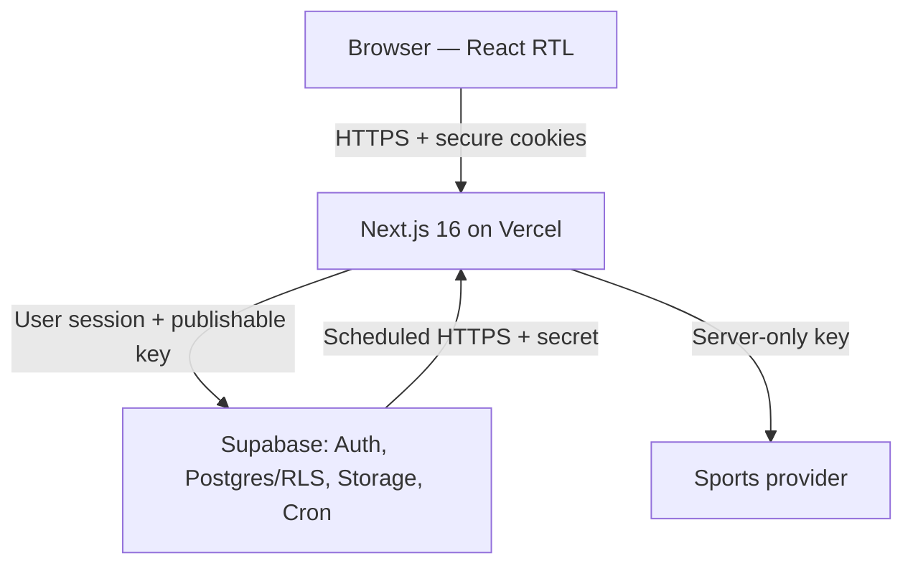
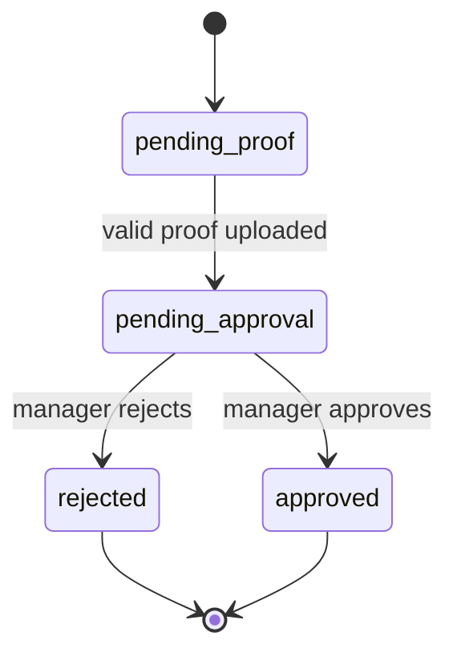

# Predictor1 — ארכיטקטורת תוכנה קנונית

| שדה | ערך |
| --- | --- |
| גרסה | 3.3 |
| תאריך עדכון | 25 באוגוסט 2026 |
| סטטוס | החלטה מחייבת למימוש |
| סגנון | Modular Monolith ב־Next.js App Router |

## 1. תפקיד המסמך

מסמך זה הוא **מקור האמת היחיד לארכיטקטורה** של Predictor1. הוא מגדיר רכיבים, גבולות אחריות, זרימות מידע, מודל נתונים, אבטחה, אינטגרציות, סקייל ופשרות.

- דרישות וחוקים עסקיים: [`product.md`](./product.md)
- צעדי מימוש, תיקיות, פעולות ובדיקות: [`technical-plan.md`](./technical-plan.md)
- הוראות עבודה לסוכנים: [`../AGENTS.md`](../AGENTS.md)
- `CLAUDE.md` מפנה למסמכים האלה ואינו מחזיק ארכיטקטורה נפרדת.

כאשר קוד והמסמך סותרים זה את זה, אין "לבחור" צד בשקט: עוצרים, בודקים מה ההחלטה הנכונה ומעדכנים קוד ומסמך יחד.

## 2. ההכרעה בקצרה

Predictor1 תיבנה כאפליקציית **Next.js 16 + TypeScript במונוליט מודולרי אחד**, תיפרס ב־Vercel ותשתמש ב־Supabase עבור PostgreSQL, Auth, Storage ו־Cron.

לא יוקם Backend נפרד. ההפרדה היא לוגית בתוך המאגר:

- React ו־Server Components להצגה ולקריאות.
- Server Actions למוטציות משתמש מתוך ה־UI.
- Route Handlers ל־HTTP חיצוני, upload ו־Cron.
- Services כמודולי TypeScript של לוגיקה עסקית.
- PostgreSQL, אילוצים, RLS ופונקציות למסלולים שחייבים אטומיות ואכיפה.

Backend נפרד היה מוסיף גבול רשת, CORS, העברת session, שירות פריסה נוסף וכפל בדיקות, בלי צורך מוצרי שמצדיק זאת בפרויקט של צוות קטן ובדדליין הנוכחי. אם בעתיד תהליך Sync יחרוג ממגבלות Vercel, מוציאים **רק אותו** ל־Supabase Edge Function או worker; לא מפצלים את המוצר מראש.

## 3. תרשים מערכת

הדפדפן אינו פונה לספק Sports ואינו מקבל את המפתח שלו. נתוני ספורט נשמרים במסד לפני שהמוצר צורך אותם.

## 4. מחסנית טכנולוגית

| שכבה | בחירה | נימוק |
| --- | --- | --- |
| Web | Next.js 16 App Router | דרישת קורס, Server Components, Server Actions ו־Route Handlers באותו deploy |
| שפה | TypeScript ב־strict mode | חוזים משותפים ובדיקות קומפילציה |
| UI | React + Tailwind CSS | כלול ב־bootstrap, מתאים ל־RTL ול־responsive בלי מערכת UI כבדה |
| Validation | Zod | schema אחד לכל גבול קלט שרת; אינו מחליף אילוצי DB |
| Database | Supabase PostgreSQL | דרישת קורס, יחסים, transactions, constraints, RLS ופונקציות |
| Authentication | Supabase Auth + `@supabase/ssr` | session מבוסס cookies ושילוב טבעי עם RLS |
| Files | Supabase Storage private bucket | RLS, הפרדה מה־webroot ו־signed URLs |
| Image hardening | `file-type` + `sharp` | בדיקת חתימה, פענוח וקידוד מחדש לקובץ תמונה בטוח יותר |
| Scheduling | Supabase Cron + HTTP Route Handler | Vercel Hobby מוגבל ל־Cron יומי; Sync משחקים דורש תדירות גבוהה יותר |
| Unit tests | Vitest | Services, validators וחישובים טהורים |
| Database tests | pgTAP דרך Supabase CLI | אילוצים, פונקציות ובעיקר RLS |
| E2E | Playwright | בדיקת זרימות משתמש והרשאות בדפדפן אמיתי |
| Hosting | Vercel | דרישת קורס ואינטגרציה טבעית עם Next.js |

אין להוסיף Redux, ORM, queue, microservice או cache חיצוני לפני שקיים צורך מדיד. PostgreSQL ו־Next.js מספיקים לסקייל של עשרות עד מאות משתמשים.

### 4.1 UI foundation של Slice 7c

Slice 7c הוא שינוי הצגה בתוך אותה ארכיטקטורה, לא subsystem חדש. השפה החזותית
מיושמת באמצעות Tailwind CSS הקיים, tokens מרכזיים ב־`globals.css` ורכיבים
משותפים מצומצמים תחת `src/components`. Server Components נשארים ברירת המחדל,
ו־Client Components מתווספים רק לאינטראקציה שכבר קיימת במוצר.

- כלי אבטיפוס חיצוני הוא כלי פיתוח בלבד. אין לו SDK, מפתח, Route, webhook או
  קריאת runtime מן האפליקציה, ואין להעביר אליו secrets, PII או אסמכתאות.
- אין להוסיף ספריית UI, אייקונים או אנימציה כתלות ייצור בלי החלטה מתועדת
  שמסבירה מדוע Tailwind, CSS ו־SVG מקומיים אינם מספיקים.
- Slice 7c אינו משנה נתיבים, חוזי Actions/Handlers, schema, RLS, הרשאות, נעילת
  ניחושים או חישובי ניקוד. שינוי כזה חוזר ל־slice פונקציונלי נפרד.
- רכיב כהה משמש סמנטית כלוח תוצאות או משחק מרכזי בלבד; אין theme כהה מקביל
  ואין state גלובלי לבחירת theme.
- אסמכתאה פרטית אינה נטענת מראש לצורך thumbnail מטושטש. הרשימה מציגה metadata
  בטוח ופעולת צפייה מפורשת ממשיכה דרך Route ההרשאה וה־signed URL הקיים.

## 5. גבולות אחריות

| רכיב | אחראי על | אסור לו |
| --- | --- | --- |
| Client Components | קלט אינטראקטיבי, countdown, optimistic UX מקומי | להכריע הרשאה, זמן נעילה או ניקוד |
| Server Components | קריאה והרכבת עמודים עם session משתמש | לבצע מוטציה בזמן render או לטעון secret key |
| `proxy.ts` | רענון cookies/session וניתוב בסיסי | להיות שכבת Authorization יחידה |
| Server Actions | AuthN, Zod, AuthZ, קריאה ל־Service, מיפוי תוצאה | להכיל לוגיקה עסקית משוכפלת או לסמוך על ה־UI |
| Route Handlers | Cron, upload, signed-file access וכניסות HTTP | לעקוף Services או RLS ללא הצדקה מתועדת |
| Services | חוקים עסקיים, orchestration, adapters וחישובים | לגשת ישירות ל־Request/Response או להחזיק state בזיכרון |
| Supabase user client | פעולות בשם המשתמש עם JWT ו־RLS | לבצע פעולות מערכת |
| Supabase admin client | Sync, scoring, תמיכת מערכת ושער Storage פרטי ומצומצם | להיכנס ל־Actions רגילים, ל־Client bundle או לשמש לעקיפת כתיבות עסקיות |
| PostgreSQL | constraints, RLS, זמן אמת, transactions וניקוד set-based | להכיל UI או קריאות ספק חיצוני בתוך trigger |
| Storage | קובצי WebP פרטיים ומדיניות גישה | bucket ציבורי או שמירת קובץ גולמי לא מאומת |

## 6. דפוסי כניסה למערכת

### 6.1 קריאות

Server Components קוראים נתונים דרך Supabase server client שנבנה עם session המשתמש ו־publishable key. ה־query מסנן במפורש לפי ליגה/מחזור/משתמש, ו־RLS הוא קו ההגנה האחרון — לא מנגנון pagination או filtering עסקי.

אין ליצור API פנימי רק כדי ש־Server Component יקרא לשרת של עצמו.

### 6.2 מוטציות משתמש

Server Actions משמשים לפעולות Auth מתוך ה־UI ולפעולות כגון יצירת ליגה, שינוי הגדרות, יצירת הזמנה, פתיחת בקשה, אישור/דחייה ושמירת ניחוש.

כל Action הוא endpoint ציבורי מבחינת מודל האיום ולכן תמיד:

1. טוען session מהשרת.
2. מאמת קלט עם Zod.
3. בודק הרשאה על המשאב בפועל ולא רק role כללי.
4. קורא ל־Service או לפונקציית DB.
5. מחזיר תוצאה טיפוסית ולא stack trace.
6. מרענן cache/tag רק אחרי commit מוצלח.

### 6.3 Route Handlers

Route Handlers שמורים למסלולים שבהם HTTP הוא חלק מהחוזה:

- `POST /api/join-requests/[requestId]/proofs` — multipart upload.
- `GET /api/payment-proofs/[proofId]` — הרשאה והפניה ל־signed URL קצר־חיים.
- `POST /api/cron/sync` — Route דק ל־manual או API-Football דרך orchestration
  שרתית, claim/apply/finalize מגודרים ו־HTTP ספק מחוץ לטרנזקציה.
- `GET /auth/confirm` — החלפת PKCE code ב־session והפניה בטוחה ליעד פנימי.

### 6.4 `proxy.ts`

ב־Next.js 16 שם הקובץ הוא `proxy.ts`; `middleware.ts` deprecated. ה־Proxy מרענן cookies של Supabase ומבצע redirect בסיסי, אך כל Action, Handler ו־query מאמתים session והרשאה מחדש. אין להציב בו לוגיקה עסקית או קריאת secret key.

## 7. Auth, keys וסודות

### 7.1 מפתחות Supabase

- `NEXT_PUBLIC_SUPABASE_URL` — כתובת הפרויקט.
- `NEXT_PUBLIC_SUPABASE_PUBLISHABLE_KEY` — `sb_publishable_...`; מותר בדפדפן רק יחד עם RLS תקין.
- `SUPABASE_SECRET_KEY` — `sb_secret_...`; שרת בלבד, עוקף RLS.

לא משתמשים בפרויקט חדש בשמות legacy `anon` ו־`service_role`. ה־secret client מוגדר בקובץ יחיד עם `import 'server-only'`, ואסור לייבא אותו מ־Client Component או מ־Service שאינו ברשימת הפעולות המורשות. ב־Slice 3 הצרכן היחיד שלו הוא שער Storage קבוע ל־bucket `payment-proofs`: ה־API המצומצם מקבל מזהי DB, גוזר נתיב פנימי ואינו חושף client כללי, bucket או path שרירותיים. הוא מקבל את טיפוס פלט ה־sanitizer ובודק מחדש WebP signature, גודל, ממדים ו־digest לפני upload; הוא רשאי למחוק object בפיצוי, לבדוק metadata פנימי וליצור signed URL רק לאחר הרשאת משאב.

מפתחות Sports ו־Cron הם משתני server-only ולעולם אינם מתחילים ב־`NEXT_PUBLIC_`.

### 7.2 Session

Supabase Auth מנהל session ב־secure cookies באמצעות `@supabase/ssr`. אין לשמור access token ידנית ב־`localStorage`, אין להעביר Bearer token לשירות Backend נפרד ואין CORS פנימי, מפני שאין גבול origin נוסף.

ב־Slice 1 שיטת ההזדהות היחידה היא Email + Password, כולל אישור Email ושחזור סיסמה. מוטציות טפסי Auth עוברות ב־Server Actions עם Zod ומשתמשות ב־Server client; ה־Browser client נשאר תשתית זמינה אך אינו גבול האכיפה. כל לקוחות Supabase מקבלים את טיפוס `Database` שנוצר מה־schema. ספק האימייל המובנה ב־Free tier אינו מאפשר תבניות `token_hash`, ולכן זרימת ה־session נשארת PKCE ודורשת את הדפדפן שיזם את הבקשה. אישור שנפתח במכשיר אחר עדיין מאשר את הכתובת ומפנה להתחברות ידנית; שחזור כזה מסביר לבקש קישור חדש בדפדפן הנוכחי. בקשת שחזור משתמשת בתוצאה typed ו־account-neutral: success וכתובת לא מוכרת שקולים, בעוד cooldown ו־outage נשארים actionable בלי לחשוף קיום חשבון. ה־callback מציג רק סטטוסים allowlisted ל־invalid/expired/reused/session mismatch/provider unavailable; replay מיידי באותו דפדפן מזוהה בעזרת digest חד־כיווני קצר־חיים שאינו גבול הרשאה. ב־Slice 3 return path של invite נשמר להרשמה ב־cookie קצר־חיים, HttpOnly ומוגבל ל־`/auth/confirm`; כתובת ה־callback שנשלחת לספק האימייל נטולת token. ה־callback מאמת ומוחק את ה־cookie. מדיניות Supabase Auth אוכפת מינימום 8 תווים גם כאשר עוקפים את ה־UI. `proxy.ts` מרענן את ה־session, והרשאה בשרת מסתמכת על משתמש שאומת מול Supabase ולא על מצב React, cookie גולמי או `getSession()` בלבד.

גישת invite נפרדת מ־Auth session: הדפדפן קורא secret רק מ־URL Fragment,
מחשב SHA-256 באמצעות Web Crypto ומחליף אותו דרך Route Handler same-origin. השרת
מציב digest מאומת ב־cookie HttpOnly, `SameSite=Lax`, מוגבל לנתיב
`/invite/[publicId]` ול־30 דקות. ה־cookie הוא credential קצר־חיים ולא מקור
הרשאה בפני עצמו; כל resolve/submit בודק מחדש את זוג `publicId`+digest, מצב
ההזמנה, תפוגה וזכאות במסד.

אין Auth Context או Redux גלובלי. Server Components הם מקור האמת ל־session, ו־Client Components נשארים בגבול הטופס האינטראקטיבי בלבד. OAuth ותמונת פרופיל אינם חלק מ־Slice 1.

### 7.3 תפקידים

- משתמש רגיל נובע מ־`auth.uid()`.
- ניהול ליגה נקבע מ־`leagues.manager_id` עבור הליגה המבוקשת.
- חברות פעילה נקבעת מ־`league_members.status = 'active'`.
- מנהלי מערכת נשמרים בטבלה מוגנת `system_admins`, לא בשדה שהמשתמש יכול לעדכן בפרופיל.

## 8. מודל הנתונים

### 8.1 תחומי נתונים

| תחום | ישויות | קשרים מרכזיים |
| --- | --- | --- |
| זהות | `profiles`, `system_admins` | `profiles.id = auth.users.id` |
| ספורט | `competitions`, `seasons`, `teams`, `matches` | תחרות → עונות → משחקים; משחק כולל שתי קבוצות |
| ליגות | `leagues`, `league_scoring_rules`, `prize_rules`, `invite_links` | ליגה שייכת לעונה ולמנהל; חוקים ופרסים שייכים לליגה |
| הצטרפות | `join_requests`, `payment_proofs`, `league_members` | בקשה מחזיקה היסטוריית הוכחות; אישור יוצר חברות |
| משחק | `predictions` | תחזית ייחודית למשתמש־ליגה־משחק |
| תפעול | `sync_runs`, `audit_logs`, `rate_limit_events` | תיעוד ריצות, פעולות רגישות ומכסות |

### 8.2 עקרונות סכימה

- כל מזהה אפליקטיבי הוא UUID.
- כל זמן נשמר כ־`timestamptz` ב־UTC.
- כסף/סכומי Demo נשמרים ביחידות הקטנות ביותר (`*_agorot`), לא `float`.
- ציונים חזויים ותוצאות הם `smallint` לא־שלילי עם תקרה סבירה.
- סטטוסים הם enum או check constraint, לא טקסט חופשי.
- כל foreign key מקבל מדיניות delete מפורשת; מידע תחרותי ואודיטורי אינו נמחק ב־cascade ללא החלטה.
- כל טבלה ב־`public` נוצרת באותה migration עם RLS, grants ו־policies; אין חלון שבו הטבלה חשופה.

### 8.3 אילוצי ייחודיות מחייבים

- `league_members (league_id, user_id)` — unique.
- `predictions (league_id, match_id, user_id)` — unique.
- `prize_rules (league_id, position)` — unique.
- `matches (external_provider, external_id)` — unique כאשר מזהה חיצוני קיים.
- `invite_links.public_id` ו־`invite_links.token_hash` — כל אחד unique; secret
  גולמי אינו נשמר, ושניהם נדרשים יחד כדי לפתור הזמנה.
- הקישור הציבורי הוא `/invite/[publicId]#invite=[secret]`. לפי סמנטיקת URI,
  ה־Fragment מופרד לפני dereference ולכן Vercel מקבל רק נתיב עם UUID ציבורי.
  Client Component מסיר אותו מיד עם `history.replaceState`, מחשב SHA-256
  בדפדפן ושולח ל־exchange רק digest קנוני. resolve/submit מעבירים ל־Data API
  `p_public_id` ו־`p_token_hash`; ה־DB מאמת digest בן 64 תווי hex ואת ההתאמה
  לאותה רשומת הזמנה לפני lookup.
- `join_requests` — partial unique על `(league_id, user_id)` כאשר הסטטוס פעיל/מאושר, כדי לאפשר בקשה חדשה רק אחרי דחייה.

### 8.4 אינדקסים ראשונים

- `matches (season_id, kickoff_at)` ו־`matches (status, kickoff_at)`.
- `predictions (match_id)` עבור ניקוד set-based.
- `predictions (league_id, user_id)` עבור היסטוריה וסיכום.
- `league_members (league_id, status)`.
- `join_requests (league_id, status, created_at)`.
- `payment_proofs (join_request_id, uploaded_at desc)`.
- `sync_runs (started_at desc)`.
- `audit_logs (entity_type, entity_id, created_at desc)`.
- `rate_limit_events (user_id, join_request_id, action, created_at)`.

אינדקס נוסף דורש query שמצדיק אותו או המלצה של Performance Advisor; לא מוסיפים אינדקס לכל עמודה.

## 9. State machines

### 9.1 בקשת הצטרפות

אחרי `rejected` נפתחת בקשה חדשה אם ההצטרפות עדיין פתוחה. ההיסטוריה הישנה נשמרת. אישור חוזר על בקשה שכבר אושרה מחזיר הצלחה אידמפוטנטית ואינו יוצר חבר כפול.

### 9.2 ליגה

`draft` → `open` → `active` → `completed` → `archived`.

- ב־`draft` מנהל משנה הגדרות וחוקי ניקוד.
- ב־`open` ניתן להצטרף; שינויי חוקי ניקוד עדיין אפשריים רק אם טרם התחיל משחק.
- `active` מתחיל לכל המאוחר בשריקת הפתיחה הראשונה; חוקי הניקוד נעולים.
- `completed` מאפשר דוח סופי אך לא ניחושים חדשים.
- `archived` הוא read-only.

Slice 8 אינו משנה lifecycle: הוא קורא את הסטטוס הקיים בלבד. Slice 9 סוגר את
המסלול המשתמשי באמצעות Actions צרים ל־`open` → `active` ול־`active` →
`completed`. כל Action יהיה session → Zod → הרשאת מנהל על משאב הליגה →
פונקציית DB אטומית שמאמתת את מצב המקור ותנאי המעבר; הלקוח אינו קובע actor או
עוקף את חישוב הניקוד הסופי.

### 9.3 משחק

`scheduled` ↔ `postponed` → `live` → `finished`, או `scheduled/postponed` →
`canceled`. ספק רשאי להחזיר משחק שבוטל ל־`scheduled`/`postponed` רק כאשר לא
נרשמה התחלה: אין `predictions_locked_at`, גם המועד הקנוני השמור וגם המועד החדש
בעתיד, והמשחק אינו `manual override`. מעבר כזה הוא reactivation מפורש ולא
regression רגיל. ההכרעה נעשית תחת נעילת שורת המשחק ולפי wall-clock מסדי טרי;
מועד שמור שכבר חל הופך ל־latch ואינו מוחלף במועד ספק עתידי.

`kickoff_at` הוא גבול הזמן הראשי. `predictions_locked_at` הוא latch נוסף שנקבע
רק לאחר שהמערכת כבר התירה חשיפה לפי המועד או צפתה במצב שמוכיח התחלה/הפסקה/
סיום; לכן ביטול מוקדם לבדו אינו חושף ניחושים לפני הפתיחה.

## 10. ניקוד ודירוג

### 10.1 חוקי ניקוד לכל ליגה

`league_scoring_rules` מכילה לפחות:

- `exact_points` — ברירת מחדל 3.
- `correct_outcome_points` — ברירת מחדל 1.
- `incorrect_points` — ברירת מחדל 0.
- `version` — עולה בכל שינוי חוקי לפני נעילה.
- `locked_at` — נקבע לפני/עם תחילת המשחק הראשון.

ב־MVP הכללים אינם ניתנים לשינוי אחרי `locked_at`. בעתיד, אם יידרשו שינויי אמצע עונה, מוסיפים טבלת גרסאות ותוקף לפי זמן; לא משנים בשקט את משמעות `version` הקיימת.

### 10.2 `score_match`

פונקציית PostgreSQL אטומית מקבלת משחק ותוצאה מאומתת, נועלת את רשומת המשחק,
מעלה `result_version` כאשר התוצאה השתנתה ומבצעת overwrite דטרמיניסטי לניחושים
שהותר לנקד. הניקוד האוטומטי חל רק על ליגות שאינן `completed`: תוצאה חדשה או
מתוקנת אינה רשאית לשכתב בשקט snapshot, ניקוד או דירוג סופי של ליגה שהושלמה.

תוצאת ספק שאינה בטוחה לזמן החוקי נשמרת ב־`match_result_reviews` לפי
`(match_id, result_version)`. הכרעת system admin נועלת match ואז review, מקבלת
רק review ממתין של הגרסה הנוכחית, וכותבת אטומית תוצאה חוקית קנונית או ביטול.
stale version, replay, actor זר או תיקון ספק מקביל נדחים ללא mutation. לאחר
ההכרעה `score_match` מנקד מחדש רק ליגות שאינן `completed`; לכל ליגה שהושלמה
ושאכן מכילה את המשחק ב־`league_match_snapshots` נוצרת רשומת
`league_match_reconciliations` עמידה וייחודית לפי
`(league_id, match_id, result_version)`.

רק גבול system-admin צר של reconciliation רשאי להחיל שינוי על תוצאה סופית.
הוא לוקח תחילה advisory key דו־חלקי לפי מזהה הליגה, ואז נועל
league→match→snapshot→reconciliation לפי סדר הנעילות הקנוני, מאמת
שהגרסה pending ועדכנית ושה־snapshot הקפוא קיים, מעדכן את ה־snapshot ומבצע
overwrite דטרמיניסטי לניחושי אותה ליגה בלבד. דחייה מסמנת את הרשומה
`dismissed` בלי לשנות snapshot או ניקוד. משחק שנוסף לעונה אחרי completion אינו
נכנס לסט הקפוא, אינו יוצר reconciliation ואינו משנה את הדוח הסופי. כל apply,
dismiss ו־replay מתועדים; replay מוצלח הוא no-op ואינו מכפיל audit.

בגבול ה־Manual, `create_or_correct_match` אינו מקבל status גנרי. יצירה או
תיקון שמשפיעים על עונה עם ליגה `completed` חייבים לעבור באותו חוזה review/
reconciliation; פעולה שאינה יכולה ליצור את הרשומות הגרסאיות הנדרשות נדחית
בקוד `COMPLETED_RECONCILIATION_REQUIRED`.

לאחר השגת נעילת המשחק הפונקציה דוגמת `clock_timestamp()` ודוחה מעבר ל־
`finished` כאשר הדגימה מוקדמת מ־`kickoff_at`. ביטול לפני מועד המשחק נשאר חוקי ואינו
מוחק ניחושים.

לכל ניחוש:

1. משווים תוצאה מדויקת.
2. אחרת משווים את סימן `predicted_home - predicted_away` לסימן `home_score - away_score`; אפס מייצג תיקו.
3. כותבים מחדש `points`, `is_exact`, `is_correct_outcome`, `predicted_outcome`, `scored_at`, `scored_result_version` ו־`scored_rule_version`.

הפונקציה **אינה** עושה `points = points + x`. לכן ריצה כפולה, retry או תיקון תוצאה אינם מכפילים ניקוד.

תוצאה ידנית ותוצאה מספק עוברות באותו חוזה. `is_manually_overridden = true` מונע מ־Sync עתידי לדרוס תיקון עד שמנהל מערכת מסיר את הדגל.

הסרת הדגל עוברת בגבול נפרד וצר: `ManualOverrideClearBoundary` לוכד את UUID
המשחק שנקרא מהמסד ואינו מקבל מזהה authoritative מהטופס; לאחר session,
confirmation והרשאת משאב, gateway מסוג `server-only` קורא ל־
`clear_manual_match_override` באמצעות actor קבוע מ־header שרתי. ה־RPC זמינה
רק ל־`service_role`, מאמתת מחדש את ה־actor, מקבלת רק שורת API-Football עם
external ID מספרי תקין, נועלת את ליגות העונה בסדר UUID ואז את המשחק ומוודאת
שהעונה לא השתנתה. מעבר ownership ממשי בעונה `completed`/`archived` נדחה עד
מסלול reconciliation של W4. הפעולה משנה רק `is_manually_overridden` ו־
`updated_at` ומוסיפה audit יחיד; היא אינה משנה status, scores, result version,
provider provenance, prediction-lock latch או predictions. replay לאחר הסרה
מחזיר no-op typed ואינו מזיז timestamp או מכפיל audit, וה־snapshot הבא של
הספק רשאי לחזור למסלול apply הרגיל.

הרחבה צרה של אותו חוזה מטפלת ב־reactivation מצד `api-football`: רק משחק
`canceled` ללא latch, עם מועד עתידי מאומת ויעד `scheduled`/`postponed`, רשאי
לחזור למצב פתוח. באותה טרנזקציה `score_match` מעלה את `result_version` ומחזירה
את כל הניחושים למצב הקנוני "טרם נוקד": `points=0` וכל metadata הניקוד `null`.
אין כתיבת ניקוד מתוך apply ואין פונקציית ניקוד מתחרה. הפעולה נרשמת ב־audit.

### 10.3 דירוג

ה־leaderboard הוא View או query מסכם, לא טבלה נוספת ב־MVP. נקודת המוצא שלו היא כל `league_members` הפעילים, עם `LEFT JOIN` לניחושים, כך שגם חבר ללא ניחושים מופיע עם 0. הוא מסכם לפי `(league_id, user_id)` ומחזיר:

- סך נקודות.
- מספר כיוונים נכונים.
- מספר תוצאות מדויקות לצורך תצוגה.
- מספר ניחושים שהוגשו.
- `rank()` לפי נקודות ואז כיוונים נכונים. אין להשתמש ב־`dense_rank()`: שני חברים במקום 1 תופסים את מקומות התחרות 1–2, והבא אחריהם הוא במקום 3.

כל האגרגטים כוללים רק ניחושים ש־`kickoff_at` שלהם הגיע. כך גם הצופה עצמו אינו
רואה בדירוג את עצם ההגשה לפני חלון החשיפה, והתוצאה אינה תלויה בזהות הצופה.
אם מנהל מורשה לראות את החברות אך RLS של `profiles` מסתירה שם, ה־View מחזיר
תווית ניטרלית במקום להפיל את כל הדירוג.

חלוקת מקום ופרסים בשוויון מחושבת ב־Service טהור ומכוסה בבדיקות יחידה. Materialized view או leaderboard table יישקלו רק אם מדידות מצביעות על בעיה.

### 10.4 דוח מנהל לא־כספי

`/leagues/[leagueId]/reports` הוא Server Component דינמי וקריא בלבד. הוא
מאמת UUID ו־session, קורא תחילה את רשומת הליגה דרך Supabase user client תחת
RLS ודורש התאמה מדויקת ל־`leagues.manager_id`. רק לאחר ההרשאה הוא מבצע קריאות
חסומות נוספות:

- ספירת `league_members.status='active'` הנוכחיים בלבד; ייחודיות
  `(league_id,user_id)` מבטיחה ספירה אחת לחברות.
- ספירות נפרדות של `join_requests` במצבים `pending_approval`, `pending_proof`
  ו־`rejected`. אין join ל־`payment_proofs`, ולכן היסטוריית קבצים אינה מכפילה
  בקשות ואינה נחשפת לדוח.
- שימוש חוזר ב־`getLeagueStandings` וב־`league_leaderboard`; אין מימוש ranking
  נוסף ואין שינוי ב־points או בחוקי שובר השוויון.

שאילתות ה־count הן `head: true`, אינן מעבירות שורות ומקבלות כל מספר שלם,
לא־שלילי ובטוח ל־JavaScript; ערך malformed או שגיאת query נכשלים סגור. רשימת
הדירוג עצמה נשארת מוגבלת ל־500 שורות ונכשלת סגור במקום להציג רשימה חלקית.
חבר רגיל, משתמש זר, מנהל של ליגה אחרת ומנהל מערכת שאינו מנהל הליגה מקבלים את
אותה תשובת not-found.
`completed` בלבד מקבל תווית "דירוג סופי"; כל status אחר מקבל "דירוג נוכחי".

המסלול אינו משתמש ב־admin client, אינו מוסיף migration/RPC/action ותלות, ואינו
קורא paths, metadata של הוכחות או PII נוסף מעבר לשם התצוגה שכבר הותר בדירוג.
הדוח אינו שכבה פיננסית: אין בו AI, דמי השתתפות, קופה, תשלום, פרס כספי,
אחוזי פרס, payout מדומה או קישור תשלום.

## 11. פעולות חברות ואטומיות

`create_league(...)` היא פונקציית DB אטומית שיוצרת את הליגה, חוקי הניקוד, חוקי הפרסים וחברות פעילה של `auth.uid()`; אותו משתמש נשמר גם כ־`manager_id`. כשל בכל חלק מבטל את הכול, ולכן לא יכולה להישאר ליגה בלי חוקים או מנהל שאינו חבר.

`approve_join_request(request_id)` היא פונקציית DB אטומית:

1. קוראת את `auth.uid()` ומוודאת שהוא מנהל הליגה הרלוונטית או מנהל מערכת.
2. נועלת את הבקשה ומוודאת שהיא `pending_approval`.
3. יוצרת/מפעילה `league_members` תחת unique constraint.
4. מעדכנת את הבקשה ל־`approved` עם `decided_by/at`.
5. מוסיפה `audit_logs`.
6. מחזירה חברות קיימת בהצלחה אם הפעולה כבר הושלמה.

אם הפונקציה היא `SECURITY DEFINER`, היא מוגדרת עם `search_path = ''`, כל שם טבלה כולל schema, והרשאות `EXECUTE` נשללות מ־`public` ו־`anon` ומוענקות רק לתפקיד הנדרש. דחייה מתבצעת בפונקציה אטומית מקבילה או ב־trigger audit מאושר; אין לבצע update ובנפרד insert לאודיט בשתי קריאות לא־אטומיות.

## 12. RLS ו־Authorization

RLS מופעלת על כל טבלה חשופה ל־Data API. השרת בודק הרשאה כדי להחזיר שגיאה טובה; RLS בודקת אותה שוב כדי למנוע עקיפה.

| משאב | עקרון Policy |
| --- | --- |
| `profiles` | ב־Slice 1 המשתמש קורא ומעדכן רק את הרשומה שלו; לאחר יצירת מודל החברות תתווסף קריאה לפרופילים של משתמשים בעלי זיקת ליגה מותרת |
| `system_admins` | ללא גישת משתמש רגיל; ניהול שרת/DB בלבד |
| ספורט גלובלי | authenticated read; כתיבה למנהל מערכת/secret בלבד |
| `leagues`, חוקים ופרסים | חברים רואים; מנהל הליגה או מנהל מערכת דרך RPC צר לליגה מבוקשת משנים שדות מותרים ובכפוף לנעילה; אין למנהל מערכת policy רוחבי |
| `invite_links` | אין גישה ישירה; מנהל מקבל metadata בטוח, ופתרון דורש public ID ו־hash תואמים דרך RPC מצומצם |
| `join_requests` | המשתמש רואה את שלו; מנהל רואה בקשות של הליגה שלו |
| `payment_proofs` | ב־Slice 3: בעל ההעלאה ומנהל הליגה המדויקת בלבד; גישת מנהל מערכת תתווסף רק עם מודל והרשאת תמיכה מפורשים |
| `league_members` | חברי אותה ליגה רואים חברות פעילה; שינוי דרך פעולות ניהול מוגנות |
| `predictions` | חבר פעיל רואה את התחזית שלו לפני ואחרי הנעילה; חברים פעילים אחרים באותה ליגה רואים אותה רק כאשר `now() >= kickoff_at` או לאחר latch שמוכיח שהחשיפה כבר החלה; חבר שהוסר מאבד גישה; הבעלים כותב רק כל עוד הוא חבר פעיל, לפני `kickoff_at` וללא latch |
| `audit_logs` | מנהל רלוונטי או מנהל מערכת; append דרך שרת/פונקציות בלבד |
| `sync_runs` | מנהל מערכת בלבד; append דרך RPC מערכת מצומצם בלבד |

מדיניות תחזיות בודקת `now()` של PostgreSQL באותה פעולת insert/update. ה־Client אינו שולח `user_id` סמכותי; הוא נגזר מ־`auth.uid()` או מאומת מולו.

## 13. אבטחת העלאת אסמכתאות

האסמכתאה היא מידע פרטי ולא קובץ ציבורי.

### 13.1 חוזה upload

- Route Handler ייעודי, לא Server Action: ברירת המחדל של Server Actions היא גוף של 1 MB, ו־Vercel Functions מוגבלות ל־4.5 MB.
- ה־Handler רץ ב־Node.js runtime. גודל הקובץ המרבי הוא **4,000,000 bytes** וגודל בקשת ה־multipart המרבי הוא **4,250,000 bytes**, כדי להשאיר מרווח מתחת למגבלת 4.5 MB של Vercel.
- Origin חייב להתאים ל־`NEXT_PUBLIC_APP_URL` או ל־URL פריסה מדויק שמוזרק בידי
  Vercel; Host headers של המשתמש אינם מקור אמון. כך Preview פועל בלי לפתוח
  allowlist לפי suffix או לפי forwarded host.
- allowlist: JPEG, PNG או WebP בלבד. SVG, PDF, HTML, ZIP וקבצי executable נדחים.
- בדיקה בשלוש שכבות: סיומת, declared MIME ו־magic bytes; אין אמון ב־`Content-Type` בלבד.
- `sharp` חייב לפענח עם `limitInputPixels: 20_000_000`, להקטין לתיבה של 2000×2000 בלי הגדלה, להסיר metadata ולקודד מחדש ל־WebP. נשמר רק הפלט המקודד מחדש, לא המקור.
- `file-type` ו־`sharp` הן dependencies ייצור מפורשות: ל־Node/Next אין זיהוי magic bytes או codec תמונה בטוח מובנים. אין framework multipart נוסף; ה־Web Streams/FormData המובנים מספיקים אחרי קריאה חסומה.
- שם הקובץ הוא UUID שנוצר בשרת. שם הקובץ המקורי אינו חלק מהנתיב.
- נתיב מוצע: `league/{leagueId}/request/{requestId}/{proofId}.webp`.
- bucket בשם `payment-proofs` הוא private.
- אין policies ל־`storage.objects` עבור `anon` או `authenticated`; גישת Data API ישירה ל־object נדחית תמיד, והגישה עוברת רק דרך שער השרת המצומצם.
- צפייה מתבצעת רק אחרי AuthZ לפי מזהה רשומת DB, ואז signed URL של עד 60 שניות.
- קיימת מכסה של חמש הוכחות לבקשה. מכסת הקצב נשמרת ב־PostgreSQL: עד חמש ניסיונות למשתמש ולבקשה ב־15 דקות ועד 20 ניסיונות למשתמש ב־24 שעות; גם ניסיונות שנדחו אחרי בדיקות ה־session/Origin והקשר הבקשה נספרים.
- אחרי upload, פונקציית DB אטומית מאמתת את ה־object והנתיב הצפוי, אוכפת idempotency ומכסה, ורק אז יוצרת metadata. מחיקת פיצוי מותרת רק אחרי SQLSTATE שמוכיח rollback: `P0001`, מחלקות `22`/`23`, או מחלקה `40` למעט `40003`. מחלקה `08`, הקוד `40003` (`statement_completion_unknown`), shutdown וקוד חסר/לא מוכר הם תוצאה עמומה כי ייתכן שה־commit הושלם. במצב עמום ה־Handler משחזר פעם אחת בדיוק את אותה קריאת finalizer האידמפוטנטית; replay מוצלח שומר את ה־object שאליו מצביעה רשומת ה־DB, ואם גם ה־replay אינו מכריע ה־object נשאר פרטי ונשלח אירוע reconciliation מסונן. גם כשל במחיקת פיצוי נשלח לאותו מסלול, ללא חשיפת path ללקוח.
- רק rejection של Storage שמזוהה ברשימת status סגורה ככשל לפני commit (`400`, `401`, `403`, `404`, `409`, `411`, `413`, `415`, `422`, `429`) אינו מפעיל finalizer או reconciliation. תשובות `408`, `425`, `499`, כל `5xx`, כשל transport ו־status חסר/לא מוכר הן עמומות כי upload עשוי היה להישמר. במקרה כזה אין finalization ואין מחיקה: `upsert: false` אינו מספק הוכחת בעלות שמאפשרת למחוק בבטחה בלי לסכן object קיים בהתנגשות, ולכן ה־object האפשרי נשאר פרטי ונשלח אירוע reconciliation מסונן. מחיקה מותנית בעתיד תחייב marker בעלות ייחודי וחוזה Gateway מפורש.

### 13.2 היסטוריה ושמירה

כל העלאה יוצרת רשומת `payment_proofs` חדשה. אין overwrite. האסמכתאה הנוכחית היא האחרונה לפי `uploaded_at` בבקשה הפעילה.

ב־Demo משתמשים בקובצי דוגמה בלבד. אם יתקבל אישור להפעלה אמיתית בעתיד, ברירת מחדל מוצעת היא מחיקת קובצי Storage 90 יום לאחר ארכוב הליגה, תוך שמירת audit metadata לא־רגיש; המדיניות הסופית נקבעת בבדיקת הפרטיות והציות.

סריקת malware מלאה אינה חלק מה־MVP. זיהוי magic bytes הוא best-effort ואינו מוכיח שקובץ בטוח. הסיכון השיורי מתועד; allowlist, התאמת סיומת/MIME/signature, decode/re-encode חד־עמודי, bucket פרטי והיעדר הגשה כ־HTML מצמצמים אותו אך אינם שקולים לאנטי־וירוס.

## 14. Sports Sync

### 14.1 Adapter

שכבת `SportsProvider` חושפת חוזה פנימי יציב:

- `getCompetition()`
- `getTeams(season)`
- `getFixtures(dateOrRound)`
- `getResults(dateOrRound)`
- `getStandings(season)` אם הספק תומך
- מיפוי סטטוסים למודל הפנימי

קוד הליבה מכיר רק את המודל הפנימי. החלפת ספק היא adapter חדש, לא שינוי ב־UI, בסכמה העסקית או בניקוד.

### 14.2 שער POC והספק הנבחר

אין לבחור ספק לפי דף שיווק. לפני חיבור אמיתי נבדקים בתיעוד ובקריאות אמת:

1. ליגת העל הישראלית ועונת 2026/27 קיימות.
2. לוח מלא כולל timezone ומחזורים.
3. סטטוסים ותוצאות מתעדכנים בקצב מתאים.
4. המכסה והתמחור מספיקים לתכנית הסנכרון.
5. מזהי קבוצות ומשחקים יציבים.

אם השער נכשל, `ManualSportsProvider` ו־seed files הם מקור הנתונים ל־MVP. אין לעכב ניחושים, ניקוד ודירוג בגלל ספק.

ה־POC החי עבר ב־23 באוגוסט 2026 ו־API-Football של API-Sports נבחר לספק החי.
הראיות המאושרות מכסות את ליגת העל (`league=383`), עונת `2026`, 14 קבוצות,
26 מחזורי עונה סדירה ו־182 משחקים שפורסמו בזמן הבדיקה. אין להסיק מכך שהעונה
תישאר תמיד בגודל הזה: שלבי אליפות/ירידה או משחקים נוספים עשויים להתפרסם
בהמשך ומתגלים באמצעות reconciliation תקופתי.

`ManualSportsProvider` והזנת התוצאות הידנית נשארים Plan B מחייב. קטלוג ה־Demo
של Slice 5 סינתטי וחסר provider IDs; אין להצמיד אליו מזהי API-Football לפי שם,
קוד, מיקום במערך או אצטדיון. נתוני ספק נשמרים בישויות provider-owned נפרדות.

### 14.3 Scheduling, lease ו־fencing

Supabase Cron מפעיל את `POST /api/cron/sync` בערך פעם בדקה. ערך הסוד נשמר
ב־Supabase Vault וב־Vercel כ־`CRON_SECRET`; ה־job קורא אותו בזמן ריצה, והוא
אינו מופיע ב־migration או ב־Git. תדירות ה־Cron היא רק תדירות בדיקת העבודה:
claim שאינו due מחזיר `NOT_DUE` בלי קריאת ספק ובלי שורת `sync_runs`.

הטרנספורט למסד הוא `supabase-js` מול Supabase Data API/PostgREST. כל קריאת
`.rpc()` היא בקשת HTTP וטרנזקציה נפרדת על connection מתוך pool; ל־Route
Handler אין connection קבוע. לכן session advisory lock אסור, ו־transaction
advisory lock אינו lease לעבודה שחוצה RPC. מסלול API-Football משתמש ב־lease
עמיד בשורה וב־fencing:

1. ה־Handler מאמת content type ו־`CRON_SECRET`, וטוען principal שרת קבוע מתוך
   `SYNC_SYSTEM_ACTOR_ID`. manual trigger מאומת משתמש בזהות מנהל המערכת המחובר.
   בשני המקרים ה־actor נבדק שוב בתוך ה־RPC מול `system_admins`.
2. claim RPC נועלת לזמן קצר את שורת `sync_leases` של `api-football`, ורק אז
   דוגמת `clock_timestamp()` טרי לבדיקת expiry, backoff, cooldown ו־due של
   קטלוג, reconciliation או targeted refresh. ממתין אינו שומר החלטת זמן ישנה.
3. claim מוצלח מגדיל `generation` מונוטוני, יוצר token UUID חדש שאינו ממוחזר,
   דוגם זמן issuance טרי, יוצר `sync_runs.status='running'` ומגדיר
   `locked_until = started_at + 120 seconds`. manual trigger רשאי
   לעקוף due-window אך לא lease פעיל, provider backoff או cooldown עמיד של דקה
   בין ניסיונות force; כך לחיצות מנהל אינן יוצרות retry storm.
4. אם lease קודם פג, ה־claim מסיים את הריצה הנטושה כ־`failed/LEASE_EXPIRED`
   לפני reclaim. אם lease עדיין פעיל, ניסיון מורשה נרשם סופית כ־
   `skipped/CONCURRENT_ATTEMPT`. `NOT_DUE` אינו נשמר.
5. API-Football נקרא מחוץ לטרנזקציה, דרך client server-only עם GET בלבד,
   timeout, response-size cap, validation, retry מוגבל ומכסה נצפית. ה־UI לעולם
   אינו קורא לספק; PostgreSQL הוא מקור האמת לכל דף משתמש.
6. apply RPC מקבלת רק payload פנימי מנורמל וחסום. היא נועלת את שורת ה־lease
   ומאמתת run, provider, generation, token ו־expiry לפני mutation ושוב בסוף
   הטרנזקציה. בדיקת הסיום גורמת rollback מלא אם ה־lease פג בזמן batch. fixture
   עם regression לא־בטוח מוכנס ל־review ונעשה לו skip מקומי; הוא אינו מפיל
   fixtures תקינים אחרים באותו batch.
7. תוצאת `FT` רשמית עוברת ל־`score_match` הקיימת מתוך אותו wrapper ובאותה
   טרנזקציה. אין שכפול ניקוד ב־TypeScript או SQL. `is_manually_overridden=true`
   גורם skip מדיד ואינו נדרס.
8. finalize RPC מאמתת אותו fencing, כותבת counters ותוצאה בטוחה, מסיימת את
   הריצה ומשחררת את ה־lease. token ישן, token של provider אחר או token שפג
   נדחים תמיד.

משך ה־lease גדול מהתקציב החסום של HTTP ו־apply. אין renew ב־MVP; אם מדידה
תראה שהעבודה התקינה מתקרבת לתוקף, מוסיפים renew RPC צר לפני שמאריכים זמן רשת.
ריצת קטלוג מחולקת ל־batches אטומיים וחסומים; partial catalog שנשמר לפני כשל
הוא תקין, provider-owned ואידמפוטנטי, והריצה הבאה משלימה אותו. תוצאה וניקוד של
כל משחק נשארים אטומיים באותו batch.

שרשרת הזמן המתוזמנת קבועה ומדידה: provider client עד 30 שניות; `pg_net` עד
45 שניות; Route Handler עם `maxDuration=60`; lease מסדי של 120 שניות. כך יש
15 שניות בין תקציב הספק לתצפית החיצונית ועוד 15 שניות עד תקרת ה־Route, וכל
המסלול נשאר מגודר לפני expiry. ‏60 שניות נתמכות גם ב־Hobby ללא Fluid compute
לפי [התיעוד הרשמי של Vercel](https://vercel.com/docs/functions/configuring-functions/duration).
Migration פרטית משנה רק את ה־job הקיים משם provider-specific לשם
`predictor-sports-sync` ומ־10 ל־45 שניות, תוך שמירת target/Vault headers,
schedule ו־active state; היא אינה יוצרת job חסר ואינה מחזירה command שעלול
להכיל lookup סודי.

במצב `manual`, הזרימה נשארת ללא HTTP לספק אך אינה עוד short-circuit. ה־adapter
בונה את `manual-catalog-v1` הדטרמיניסטי והחסום, וה־gateway קורא פעם אחת ל־
`apply_manual_fixture_catalog()`. זהו wrapper צר `SECURITY DEFINER` שמקבל payload
בלבד, גוזר actor קבוע מה־gateway ומעביר אותו ל־core פרטי ללא הרשאת Data API.
ה־core מאמת ונועל מחדש את ה־actor, נועל תחילה את כל הליגות של העונה בסדר UUID,
אחר כך teams ו־matches בסדר קבוע, מאמת parity מלא וזהויות provider ריקות,
ומכניס רק שורות חסרות לפי UUID. drift בשדות הקבועים, שורת provider-owned,
latch על משחק catalog או השלמת catalog חסר בעונה שיש בה ליגה `completed` או
`archived` נכשלים אטומית ואינם נדרסים. מיד לפני insert חסר ה־core דוגם זמן DB
טרי; fixture חסר שהגיע למועדו אינו משוחזר כמשחק היסטורי לא־נעול. prediction
כשלעצמו אינו מפריע ל־replay זהה;
בגבול `create_or_correct_match`, שינוי זהות season/teams נחסם כאשר קיימים
prediction או latch.

כל קריאה תקינה שהגיעה ל־RPC אחרי בניית ה־payload השרתית יוצרת בדיוק שורת
`sync_runs` סופית אחת. שינוי ממשי מחזיר `MANUAL_APPLIED`, replay זהה מחזיר
`MANUAL_NO_CHANGE`, ו־conflict מחזיר `MANUAL_CATALOG_CONFLICT`; קודי ההצלחה
מוחזרים מתוצאת ה־RPC ואינם נשמרים ב־`error_code`, שנשאר `null` כאשר
`status='succeeded'`. רק mutation ראשון יוצר business audit. כשל config או
validation לפני קריאת ה־RPC אינו invocation מסדי ולכן אינו מבטיח שורת run.
`record_sync_attempt()` הוסר כדי שלא יישאר גבול Manual חלופי. בקשה לא מורשית
אינה כותבת `sync_runs` או `audit_logs` בשני מסלולי הספק.

### 14.4 Due planner ומדיניות מכסה

- קטלוג league/teams/rounds/fixtures מתרענן כל 12 שעות; גבול מתועד של 6–24
  שעות מאפשר התאמה עתידית בלי לשנות את חוזה ה־lease.
- reconciliation של fixtures מתבצע כל 6 שעות כדי לגלות תיקוני מועד, משחקים
  ומחזורים נוספים.
- משחקים חיים, משחקים שמועדיהם קרובים ומשחקים שעדיין אינם terminal אחרי
  kickoff מתרעננים בבקשת `ids` ממוקדת בערך פעם בדקה, עד 20 IDs לבקשה.
- כאשר כמה סוגי עבודה due יחד, ה־claim מדרג את `targeted`, ‏`catalog` ו־
  `reconciliation` לפי זמן ה־claim המגודר האחרון של כל סוג, ולא לפי הצלחה
  בלבד. לכן כל סוג due נבחר בתוך לכל היותר שלושה claims זכאים עוקבים, גם אם
  סוג קודם נכשל. lease פעיל, provider backoff או force cooldown משעים את
  הספירה ואינם נעקפים. בתוך targeted, משחקי `live` קודמים לכל stale/near-live,
  ואז נשמר סדר kickoff ו־external ID דטרמיניסטי במכסה של 20.
- `provider_status` טרמינלי שאינו בר־ניקוד, ובפרט `AET`/`PEN`, הוא מקור review
  עמיד ואינו נשאר ב־targeted polling. הוא ממשיך להתגלות ב־reconciliation.
- 429 מסווג כ־`PROVIDER_RATE_LIMITED` לפני המתנה: `Retry-After` קצר יכול לקבל
  retry בתוך תקציב ה־wall-clock, ואילו hint שאינו נכנס בתקציב מוחזר מיד בלי
  שינה. רק מספר שניות שלם ולא־שלילי, חסום ל־`0..3600`, ו־quota remaining
  שלם ולא־שלילי מועברים ל־finalize; headers גולמיים אינם נשמרים.
  `backoff_until` נאכף גם ב־scheduled וגם ב־force. מדיניות threshold אוטומטית
  למכסה נמוכה תתווסף רק עם ראיה תפעולית. אין retry storm ואין polling כל 15
  שניות.
- force נוסף בתוך דקת ה־cooldown חוזר מה־RPC כ־
  `NOT_DUE/FORCE_COOLDOWN`. החוזה הזה הוא skip ניטרלי לכל אורך DB → gateway →
  orchestration → Route/Action; אין provider I/O, ‏finalize או שורת run חדשה.
- ה־orchestration מפרידה גבולות כשל: קודי `PROVIDER_*` נוצרים רק בשלב קריאת
  הספק, `SYNC_PLAN_FAILED` בתכנון snapshot מנורמל, `SYNC_APPLY_FAILED` בכתיבת
  batch ו־`SYNC_FINALIZE_FAILED` רק כאשר ה־finalizer עצמו נכשל. פרטי exception,
  payload ושמות אינם עוברים ל־DB או לתוצאה. כשל provider/planner שומר
  `fixtures_seen=0`; כשל apply שומר רק את `fixtures_seen`, המכסה וההערות שכבר
  אומתו בתכנית. כשל finalizer אינו מפעיל finalizer שני, ולכן lease/run נשארים
  לגידור ול־reclaim הקיים במקום לנסות mutation לא־מגודר.
- ה־Base URL, league ID והעונה הם constants/configuration typed ולא קלט
  משתמש. ה־API key נשמר רק ב־Vercel עבור Next.js ואינו נשמר ב־Vault.

### 14.5 זהות, סטטוסים ונעילת ניחושים

API-Football מזוהה פנימית כ־`api-football`. תחרות, עונה, קבוצות ומשחקים
provider-owned מזוהים רק באמצעות `(external_provider, external_id)`. קוד או
שם קבוצה אינם זהות. העונה שומרת external season `2026`, ומשחק שומר גם את
`league.round` המלא לצד `round_number`; פורמט stage לא מוכר נכנס ל־review ואינו
מתנגש בשקט במחזור קיים. קטלוג `sports_provider_rounds` שומר כל label lossless;
stage לא מוכר נשמר בו עם `round_number=null` ואינו נוסף אוטומטית לקיבוץ ה־UI.

`FT` בלבד נחשב תוצאה רשמית אוטומטית, ורק `score.fulltime` משמש לניקוד. ציוני
live אינם נשמרים כתוצאה. `AET` ו־`PEN` מזוהים ונשמרים ב־`provider_status`,
קובעים את latch הנעילה ונרשמים כ־review, אך אינם משנים את המשחק ל־finished
ואינם מפעילים ניקוד עד שתתקבל הכרעת מוצר ושדה 90 דקות יוכח בחוזה מוקלט.
status לא מוכר מכשיל את ה־snapshot לפני mutation.

`matches.predictions_locked_at` הוא latch מסדי בלתי־הפיך של נעילת ספק. הוא
נקבע כאשר נצפה live, `SUSP`, `INT`, `FT`, `AET` או `PEN`. עבור כל משפחת
הביטול `CANC`/`ABD`/`AWD`/`WO`, הקוד החיצוני לבדו אינו מוכיח התחלה: latch
נקבע רק אם היה latch קודם או שזמן המסד כבר הגיע למועד הקנוני השמור או למועד
החדש המאומת מהספק (וב־fixture חדש — למועד החדש בלבד). החישוב נעשה לאחר נעילת
שורת המשחק; גם כאשר `manual override` מונע שינוי תוצאה של הספק, ה־latch העצמאי
נשמר. כך שינוי מועד יחד עם ביטול אינו יכול להחזיר חשיפה לאחור, וביטול מוקדם
אינו מפר את PRED-05.

`save_prediction`, RLS של החשיפה וה־UI בודקים latch בנוסף ל־`kickoff_at`.
משחק `canceled` ללא latch יכול לעבור אוטומטית חזרה ל־`scheduled`/`postponed`
רק כאשר גם ה־kickoff השמור וגם הנכנס עתידיים; `score_match` מאפסת אטומית את metadata הניקוד למצב טרם
נוקד. finished, live או canceled עם latch אינם נפתחים מחדש. regression כזה
אינו מפיל batch: מצב המשחק הבטוח נשמר, `provider_status` האחרון נשמר כראיית
review ונוספת הערת מפעיל חסומה. `AET`/`PEN` מוצגים כ־"דורש בדיקה" על סמך
`provider_status`, אינם מוצגים כמשחק live ואינם תופסים slot של targeted.

## 15. גבול היקף: נתונים שמורים בלבד

טקסט מחולל וספקי מודלים אינם חלק מארכיטקטורת ה־MVP של הקורס. אין עבורם
Route, טבלה, secret, adapter, cache או תלות ייעודיים. מסך המשחק מציג רק נתונים
שמורים ומאומתים מן המערכת. שינוי הגבול בעתיד יחייב החלטת מוצר וארכיטקטורה חדשה.

## 16. State באפליקציה ו־cache

- PostgreSQL הוא מקור האמת העסקי היחיד.
- URL search params מחזיקים מחזור, תאריך ופילטרים שניתן לשתף.
- Server Components טוענים state מתמשך.
- Client Components מחזיקים רק state זמני של טופס, modal, countdown ו־pending state.
- אין global client store ב־MVP.
- אחרי mutation משתמשים ב־`revalidatePath` או cache tags ממוקדים.
- אין cache לניחוש של משתמש לפני commit, ואין cache שחושף ניחושי אחרים לפני נעילה.

## 17. שגיאות, לוגים ואודיט

### 17.1 שגיאות

Services מחזירים error codes יציבים כגון:

- `UNAUTHENTICATED`
- `FORBIDDEN`
- `VALIDATION_ERROR`
- `PREDICTION_LOCKED`
- `JOIN_REQUEST_STATE_CONFLICT`
- `UPLOAD_REJECTED`
- `EXTERNAL_PROVIDER_UNAVAILABLE`
- `RATE_LIMITED`
- `INTERNAL_ERROR`

ה־UI ממפה אותם להודעות עברית. פרטי SQL, stack trace, path פרטי, token או API key אינם נשלחים ללקוח.

### 17.2 Audit

`audit_logs` מתעדת actor, action, entity, entity_id, metadata מצומצם ו־created_at עבור:

- אישור, דחייה והסרת חבר.
- שינוי חוקי ניקוד או פרסים.
- יצירה/ביטול הזמנה.
- תיקון תוצאה ו־manual override.
- צפייה חריגה של מנהל מערכת באסמכתאה, אם תמומש.

אין לשמור קובץ, secret, password או תוכן רגיש מלא בתוך metadata.

## 18. מודל איומים מקוצר

| איום | הגנה ראשית | בדיקת חובה |
| --- | --- | --- |
| שינוי ניחוש אחרי נעילה | שורות league→member→match ננעלות, ואז `clock_timestamp() < kickoff_at` מוכרע ב־RPC; RLS מגן על הקריאה | לפני/בדיוק/אחרי וגם waiter שמתחיל לפני kickoff ומשתחרר אחריו |
| צפייה בניחוש אחר לפני פתיחה | RLS תלוי זמן וחברות | שני משתמשים באותה ליגה לפני/אחרי |
| IDOR בין ליגות | AuthZ לפי resource + RLS | החלפת `leagueId/requestId/proofId` |
| קובץ זדוני או MIME מזויף | allowlist, magic bytes, decode/re-encode, private bucket | SVG/exe מוסווים וקובץ גדול נדחים; payload נלווה לתמונה תקינה אינו שורד את ה־re-encode |
| דליפת secret | server-only module, env, bundle scan | חיפוש build ו־Network tab |
| עקיפת route דרך Storage API | bucket פרטי ללא policies ללקוחות ושער שרת מצומצם | CRUD ישיר כ־anon/authenticated |
| אישור כפול | transaction + unique + idempotency | שתי קריאות מקבילות |
| ניקוד כפול | overwrite דטרמיניסטי + versions | אותה תוצאה פעמיים ותיקון תוצאה |
| Cron מזויף או מקביל | secret + principal ייעודי ב־`system_admins`; manual משתמש ב־RPC הקצר הקיים ו־API-Football ב־row lease עם generation/token/expiry | secret/actor שגוי, claim מקביל, reclaim, token ישן ו־expiry בזמן apply |
| שינוי מועד פותח ניחושים אחרי live/ביטול | `predictions_locked_at` בלתי־הפיך, זמן טרי תחת match lock, ושני גבולות kickoff ב־reactivation | ביטול/השעיה לפני ואחרי kickoff, reschedule לעתיד וניסיון שמירה/חשיפה |
| worker ישן כותב אחרי reclaim | fencing נבדק בתחילת ובסוף apply/finalize תחת row lock | generation/token/provider שגויים ו־lease שפג |
| עקיפה דרך Supabase Data API | RLS ו־grants לכל טבלה | קריאות ישירות עם publishable key |
| bidi spoofing בשם משתמש/ליגה/ספק | Zod/provider normalization ו־DB checks דוחים Unicode `Bidi_Control`; רכיב תצוגה יחיד משתמש ב־`bdi dir="auto"` | Vitest לכל controls וטקסט מעורב, pgTAP לכל עמודות השם, Playwright ב־Desktop/Mobile |

## 19. סקייל בסיסי

יעד ה־MVP הוא עשרות עד מאות משתמשים ומספר קטן של ליגות פעילות. הארכיטקטורה תומכת בכך באמצעות:

- queries מסוננים ו־select של עמודות נדרשות בלבד.
- pagination לבקשות, audit, היסטוריית ניחושים ומשחקים; מחזור הוא pagination טבעי למשחקים.
- ניקוד set-based ב־PostgreSQL במקום לולאות Serverless.
- `points` שמור ו־leaderboard מסכם במקום חישוב כל ניחוש מהתחלה.
- upsert לפי provider ID מונע כפילויות בנתוני ספורט.
- אינדקסים לפי דפוסי גישה, וניתוח `EXPLAIN ANALYZE` לפני אופטימיזציה נוספת.
- Client bundle קטן באמצעות Server Components כברירת מחדל.

מגבלות ידועות:

- leaderboard query רגיל אינו יעד לאלפי משתתפים בליגה; במקרה כזה נבחן materialized view.
- `rate_limit_events` ב־PostgreSQL מתאים ל־MVP, לא לתעבורה גדולה או רב־אזורית.
- Sync רץ ב־request lifecycle ומוגבל ב־lease, timeout ו־batches.
  עומסים או ריצות ארוכות שיימדדו יצדיקו worker נפרד, לא נבנה כזה מראש.
- API-Football מתעד rate limit גם לפי IP. Vercel משתמשת ב־outbound IP משותף,
  ולכן 429 אפשרי גם מתעבורה שאינה שלנו; backoff ונתונים שמורים הם ההגנה ב־MVP.
- Supabase/Vercel free tiers הם מגבלת קיבולת תפעולית, לא יעד ארכיטקטוני קבוע.

## 20. סביבות, migrations ופריסה

- Local: Supabase CLI + Next.js local; migrations ו־seed הם מקור האמת.
- Test: מסד מקומי שנבנה מחדש לכל suite של DB/E2E.
- Production: Vercel + Supabase hosted.
- Preview: משתמש בפרויקט development נפרד אם קיים; אסור להריץ migrations של preview מול production.

שינוי סכימה מבוצע רק ב־`supabase/migrations`. שינוי ידני ב־Dashboard חייב להימשך מיד ל־migration לפני המשך עבודה. אחרי כל שינוי סכימה מייצרים מחדש TypeScript types ומוודאים שאין diff.

Deployment ראשון מתבצע ב־Slice 0, לא בסוף הפרויקט. כל slice צריך להגיע ל־URL עובד ולהוסיף בדיקות ומסמכים רלוונטיים.

## 21. החלטות ארכיטקטורה

| החלטה | סטטוס | נימוק |
| --- | --- | --- |
| Backend נפרד | נדחה | מורכבות רשת ופריסה בלי צורך מוצרי ב־MVP |
| Modular Monolith ב־Next.js | התקבל | שליטה דרך גבולות מודולים עם deploy יחיד |
| Server Actions + Route Handlers | התקבל | Actions ל־UI; Handlers ל־HTTP/integrations/uploads |
| Services משותפים | התקבל | מונע כפילות לוגיקה בין נקודות כניסה |
| RLS על כל טבלה | מחייב | publishable key חשוף by design; DB הוא קו הגנה אחרון |
| `proxy.ts` | מחייב | convention של Next.js 16; `middleware.ts` deprecated |
| Publishable/secret keys חדשים | מחייב | legacy keys מיועדים ל־deprecation; secret עוקף RLS |
| `join_requests` ו־`league_members` נפרדות | התקבל | תהליך מול עובדת חברות |
| `payment_proofs` 1:N | התקבל | שומר היסטוריה ופרטיות בלי overwrite |
| גישה ישירה של לקוח ל־Storage | נדחה | route מאמת קובץ והרשאת משאב; השער הקבוע הוא consumer יחיד של secret ב־Slice 3 |
| `points` נשמר ב־`predictions` | התקבל | דירוג יעיל ותמיכה בחוקי ניקוד שונים לכל ליגה |
| Leaderboard כ־View/query | התקבל | אין הצדקה לטבלה משוכפלת ב־MVP |
| Slice 8 — דוח מנהל לא־כספי | התקבל | query-only מעל RLS וה־leaderboard הקיים; אין schema, admin client, AI או חישוב כספי |
| ניקוד ב־PostgreSQL | התקבל | אטומיות, idempotency ו־set-based update |
| Supabase Cron | התקבל | Vercel Hobby Cron יומי בלבד; נדרש polling תכוף יותר |
| ספק Sports קבוע מראש | הוחלף | API-Football נבחר ב־23.8.2026 לאחר POC חי לליגה 383/עונה 2026; Manual נשאר fallback |
| Slice 7 manual-only | הוחלף | Slice 7b מוסיף API-Football provider-owned catalog ו־Sync מלא; המסלול הידני נשמר ללא mutation |
| Slice 7c — Design System ורענון UI | התקבל | Tailwind והגבולות הקיימים מספיקים; השינוי ממקד RTL, mobile, נגישות ועקביות בלי schema, route או dependency חדשים |
| lease לספק חי | התקבל | Data API אינו מצמיד connection; row lease עמיד עם generation/token/expiry מגן על HTTP שחוצה transactions |
| תוצאת AET/PEN אוטומטית | נדחה לעת עתה | מדיניות המוצר היא זמן חוקי, אך ה־POC לא הוכיח שדה 90 דקות מתאים; הרשומה נכנסת ל־review ללא scoring |
| ביטול מוקדם ו־reactivation | התקבל | PRED-05 גובר על סיווג terminal כללי: ביטול לפני חשיפה אינו קובע latch; רק canceled ללא latch ומועד עתידי יכול להיפתח מחדש, עם איפוס ניקוד אטומי דרך `score_match` |
| regression יחיד מפיל batch | נדחה | fixture לא־בטוח נשמר ל־review ומדולג מקומית כדי שקטלוג ו־reconciliation ימשיכו לעבד נתונים תקינים |
| advisory lock ברמת session דרך Data API | נדחה | connection אינו מוצמד ל־Route Handler והנעילה עלולה לדלוף ל־pool |
| מסלול כסף אמיתי בגרסת הקורס | חסום | דורש שער ציות ומשתמשים בגיל מתאים; Demo בלבד |

## 22. התאמה לדרישות הקורס

הארכיטקטורה מכסה את הרכיבים, מסד הנתונים, הישויות, העמודים, Server Actions/Route Handlers, זרימת המידע, המשתמשים, ההרשאות, השירותים החיצוניים, אבטחה בסיסית וסקייל בסיסי שנדרשו במסמך הקורס. הפירוט לביצוע ולבדיקות נמצא ב־[`technical-plan.md`](./technical-plan.md).

## 23. מקורות טכניים — אומתו ב־11 באוגוסט 2026

- [Next.js 16 — `proxy.ts`](https://nextjs.org/docs/app/api-reference/file-conventions/proxy)
- [Next.js — Data Security](https://nextjs.org/docs/app/guides/data-security)
- [Next.js — Server Actions](https://nextjs.org/docs/app/guides/server-actions)
- [Next.js — Route Handlers](https://nextjs.org/docs/app/getting-started/route-handlers)
- [Next.js — Server Action body-size limit](https://nextjs.org/docs/app/api-reference/config/next-config-js/serverActions)
- [Supabase — API keys](https://supabase.com/docs/guides/getting-started/api-keys)
- [Supabase — SSR client with cookies](https://supabase.com/docs/guides/auth/server-side/creating-a-client)
- [Supabase — Row Level Security](https://supabase.com/docs/guides/database/postgres/row-level-security)
- [Supabase — Database Functions](https://supabase.com/docs/guides/database/functions)
- [Supabase — Storage Access Control](https://supabase.com/docs/guides/storage/security/access-control)
- [Supabase — Cron](https://supabase.com/docs/guides/cron)
- [Supabase — Local development and migrations](https://supabase.com/docs/guides/local-development/cli-workflows)
- [Vercel — Cron usage and pricing](https://vercel.com/docs/cron-jobs/usage-and-pricing)
- [Vercel — Functions limits](https://vercel.com/docs/functions/limitations)
- [OWASP — File Upload Cheat Sheet](https://cheatsheetseries.owasp.org/cheatsheets/File_Upload_Cheat_Sheet.html)
- [OWASP — IDOR Prevention Cheat Sheet](https://cheatsheetseries.owasp.org/cheatsheets/Insecure_Direct_Object_Reference_Prevention_Cheat_Sheet.html)
