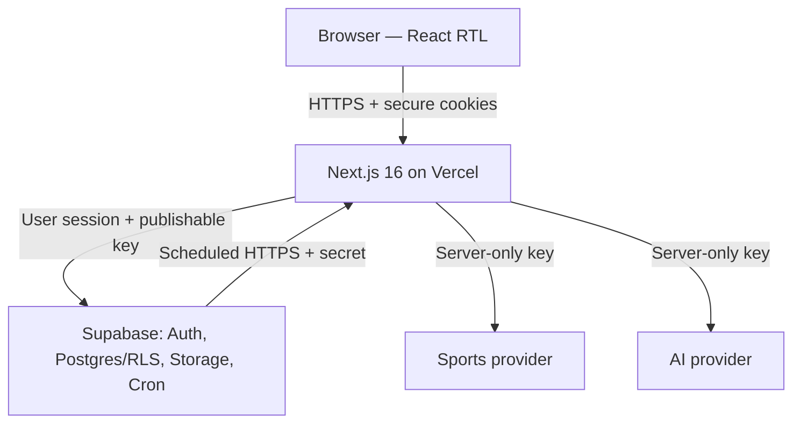
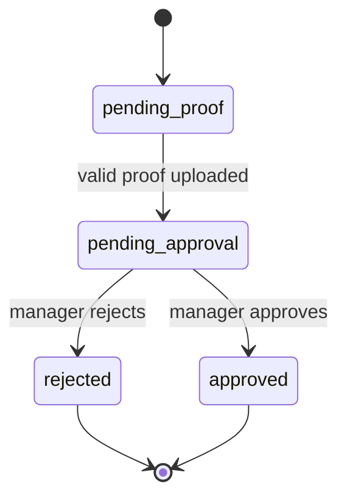

# Predictor1 — ארכיטקטורת תוכנה קנונית

| שדה | ערך |
| --- | --- |
| גרסה | 2.2 |
| תאריך עדכון | 13 באוגוסט 2026 |
| סטטוס | החלטה מחייבת למימוש |
| סגנון | Modular Monolith ב־Next.js App Router |

## 1. תפקיד המסמך

מסמך זה הוא **מקור האמת היחיד לארכיטקטורה** של Predictor1. הוא מגדיר רכיבים, גבולות אחריות, זרימות מידע, מודל נתונים, אבטחה, אינטגרציות, סקייל ופשרות.

- דרישות וחוקים עסקיים: [`product.md`](./product.md)
- צעדי מימוש, תיקיות, פעולות ובדיקות: [`technical-plan.md`](./technical-plan.md)
- הוראות עבודה לסוכנים: [`../AGENTS.md`](../AGENTS.md)
- `CLAUDE.md` מפנה למסמכים האלה ואינו מחזיק ארכיטקטורה נפרדת.

כאשר קוד והמסמך סותרים זה את זה, אין "לבחור" צד בשקט: עוצרים, בודקים מה ההחלטה הנכונה ומעדכנים קוד ומסמך יחד.

## 2. ההכרעה בקצרה

Predictor1 תיבנה כאפליקציית **Next.js 16 + TypeScript במונוליט מודולרי אחד**, תיפרס ב־Vercel ותשתמש ב־Supabase עבור PostgreSQL, Auth, Storage ו־Cron.

לא יוקם Backend נפרד. ההפרדה היא לוגית בתוך המאגר:

- React ו־Server Components להצגה ולקריאות.
- Server Actions למוטציות משתמש מתוך ה־UI.
- Route Handlers ל־HTTP חיצוני, upload, Cron ו־AI.
- Services כמודולי TypeScript של לוגיקה עסקית.
- PostgreSQL, אילוצים, RLS ופונקציות למסלולים שחייבים אטומיות ואכיפה.

Backend נפרד היה מוסיף גבול רשת, CORS, העברת session, שירות פריסה נוסף וכפל בדיקות, בלי צורך מוצרי שמצדיק זאת בפרויקט של צוות קטן ובדדליין הנוכחי. אם בעתיד תהליך Sync יחרוג ממגבלות Vercel, מוציאים **רק אותו** ל־Supabase Edge Function או worker; לא מפצלים את המוצר מראש.

## 3. תרשים מערכת

הדפדפן אינו פונה לספקי Sports או AI ואינו מקבל מפתחות שלהם. נתוני ספורט נשמרים במסד לפני שהמוצר צורך אותם.

## 4. מחסנית טכנולוגית

| שכבה | בחירה | נימוק |
| --- | --- | --- |
| Web | Next.js 16 App Router | דרישת קורס, Server Components, Server Actions ו־Route Handlers באותו deploy |
| שפה | TypeScript ב־strict mode | חוזים משותפים ובדיקות קומפילציה |
| UI | React + Tailwind CSS | כלול ב־bootstrap, מתאים ל־RTL ול־responsive בלי מערכת UI כבדה |
| Validation | Zod | schema אחד לכל גבול קלט שרת; אינו מחליף אילוצי DB |
| Database | Supabase PostgreSQL | דרישת קורס, יחסים, transactions, constraints, RLS ופונקציות |
| Authentication | Supabase Auth + `@supabase/ssr` | session מבוסס cookies ושילוב טבעי עם RLS |
| Files | Supabase Storage private bucket | RLS, הפרדה מה־webroot ו־signed URLs |
| Image hardening | `file-type` + `sharp` | בדיקת חתימה, פענוח וקידוד מחדש לקובץ תמונה בטוח יותר |
| Scheduling | Supabase Cron + HTTP Route Handler | Vercel Hobby מוגבל ל־Cron יומי; Sync משחקים דורש תדירות גבוהה יותר |
| Unit tests | Vitest | Services, validators וחישובים טהורים |
| Database tests | pgTAP דרך Supabase CLI | אילוצים, פונקציות ובעיקר RLS |
| E2E | Playwright | בדיקת זרימות משתמש והרשאות בדפדפן אמיתי |
| Hosting | Vercel | דרישת קורס ואינטגרציה טבעית עם Next.js |

אין להוסיף Redux, ORM, queue, microservice או cache חיצוני לפני שקיים צורך מדיד. PostgreSQL ו־Next.js מספיקים לסקייל של עשרות עד מאות משתמשים.

## 5. גבולות אחריות

| רכיב | אחראי על | אסור לו |
| --- | --- | --- |
| Client Components | קלט אינטראקטיבי, countdown, optimistic UX מקומי | להכריע הרשאה, זמן נעילה או ניקוד |
| Server Components | קריאה והרכבת עמודים עם session משתמש | לבצע מוטציה בזמן render או לטעון secret key |
| `proxy.ts` | רענון cookies/session וניתוב בסיסי | להיות שכבת Authorization יחידה |
| Server Actions | AuthN, Zod, AuthZ, קריאה ל־Service, מיפוי תוצאה | להכיל לוגיקה עסקית משוכפלת או לסמוך על ה־UI |
| Route Handlers | Cron, AI, upload, signed-file access וכניסות HTTP | לעקוף Services או RLS ללא הצדקה מתועדת |
| Services | חוקים עסקיים, orchestration, adapters וחישובים | לגשת ישירות ל־Request/Response או להחזיק state בזיכרון |
| Supabase user client | פעולות בשם המשתמש עם JWT ו־RLS | לבצע פעולות מערכת |
| Supabase admin client | Sync, scoring, תמיכת מערכת ופעולות מוגבלות | להיכנס ל־Actions רגילים או ל־Client bundle |
| PostgreSQL | constraints, RLS, זמן אמת, transactions וניקוד set-based | להכיל UI או קריאות ספק חיצוני בתוך trigger |
| Storage | קובצי WebP פרטיים ומדיניות גישה | bucket ציבורי או שמירת קובץ גולמי לא מאומת |

## 6. דפוסי כניסה למערכת

### 6.1 קריאות

Server Components קוראים נתונים דרך Supabase server client שנבנה עם session המשתמש ו־publishable key. ה־query מסנן במפורש לפי ליגה/מחזור/משתמש, ו־RLS הוא קו ההגנה האחרון — לא מנגנון pagination או filtering עסקי.

אין ליצור API פנימי רק כדי ש־Server Component יקרא לשרת של עצמו.

### 6.2 מוטציות משתמש

Server Actions משמשים לפעולות Auth מתוך ה־UI ולפעולות כגון יצירת ליגה, שינוי הגדרות, יצירת הזמנה, פתיחת בקשה, אישור/דחייה ושמירת ניחוש.

כל Action הוא endpoint ציבורי מבחינת מודל האיום ולכן תמיד:

1. טוען session מהשרת.
2. מאמת קלט עם Zod.
3. בודק הרשאה על המשאב בפועל ולא רק role כללי.
4. קורא ל־Service או לפונקציית DB.
5. מחזיר תוצאה טיפוסית ולא stack trace.
6. מרענן cache/tag רק אחרי commit מוצלח.

### 6.3 Route Handlers

Route Handlers שמורים למסלולים שבהם HTTP הוא חלק מהחוזה:

- `POST /api/join-requests/[requestId]/proofs` — multipart upload.
- `GET /api/payment-proofs/[proofId]` — הרשאה והפניה ל־signed URL קצר־חיים.
- `POST /api/cron/sync` — הפעלת Sync עם secret ונעילת ריצה.
- `GET /auth/confirm` — החלפת קוד האישור של Supabase ב־session והפניה בטוחה ליעד פנימי.
- `POST /api/matches/[matchId]/analysis` — ניתוח AI לפי דרישה.

### 6.4 `proxy.ts`

ב־Next.js 16 שם הקובץ הוא `proxy.ts`; `middleware.ts` deprecated. ה־Proxy מרענן cookies של Supabase ומבצע redirect בסיסי, אך כל Action, Handler ו־query מאמתים session והרשאה מחדש. אין להציב בו לוגיקה עסקית או קריאת secret key.

## 7. Auth, keys וסודות

### 7.1 מפתחות Supabase

- `NEXT_PUBLIC_SUPABASE_URL` — כתובת הפרויקט.
- `NEXT_PUBLIC_SUPABASE_PUBLISHABLE_KEY` — `sb_publishable_...`; מותר בדפדפן רק יחד עם RLS תקין.
- `SUPABASE_SECRET_KEY` — `sb_secret_...`; שרת בלבד, עוקף RLS.

לא משתמשים בפרויקט חדש בשמות legacy `anon` ו־`service_role`. ה־secret client מוגדר בקובץ יחיד עם `import 'server-only'`, ואסור לייבא אותו מ־Client Component או מ־Service שאינו ברשימת הפעולות המורשות.

מפתחות Sports, AI ו־Cron הם משתני server-only ולעולם אינם מתחילים ב־`NEXT_PUBLIC_`.

### 7.2 Session

Supabase Auth מנהל session ב־secure cookies באמצעות `@supabase/ssr`. אין לשמור access token ידנית ב־`localStorage`, אין להעביר Bearer token לשירות Backend נפרד ואין CORS פנימי, מפני שאין גבול origin נוסף.

ב־Slice 1 שיטת ההזדהות היחידה היא Email + Password, כולל אישור Email ושחזור סיסמה. מוטציות טפסי Auth עוברות ב־Server Actions עם Zod ומשתמשות ב־Server client; ה־Browser client נשאר תשתית זמינה אך אינו גבול האכיפה. מדיניות Supabase Auth אוכפת מינימום 8 תווים גם כאשר עוקפים את ה־UI. `proxy.ts` מרענן את ה־session, והרשאה בשרת מסתמכת על משתמש שאומת מול Supabase ולא על מצב React, cookie גולמי או `getSession()` בלבד.

אין Auth Context או Redux גלובלי. Server Components הם מקור האמת ל־session, ו־Client Components נשארים בגבול הטופס האינטראקטיבי בלבד. OAuth ותמונת פרופיל אינם חלק מ־Slice 1.

### 7.3 תפקידים

- משתמש רגיל נובע מ־`auth.uid()`.
- ניהול ליגה נקבע מ־`leagues.manager_id` עבור הליגה המבוקשת.
- חברות פעילה נקבעת מ־`league_members.status = 'active'`.
- מנהלי מערכת נשמרים בטבלה מוגנת `system_admins`, לא בשדה שהמשתמש יכול לעדכן בפרופיל.

## 8. מודל הנתונים

### 8.1 תחומי נתונים

| תחום | ישויות | קשרים מרכזיים |
| --- | --- | --- |
| זהות | `profiles`, `system_admins` | `profiles.id = auth.users.id` |
| ספורט | `competitions`, `seasons`, `teams`, `matches` | תחרות → עונות → משחקים; משחק כולל שתי קבוצות |
| ליגות | `leagues`, `league_scoring_rules`, `prize_rules`, `invite_links` | ליגה שייכת לעונה ולמנהל; חוקים ופרסים שייכים לליגה |
| הצטרפות | `join_requests`, `payment_proofs`, `league_members` | בקשה מחזיקה היסטוריית הוכחות; אישור יוצר חברות |
| משחק | `predictions`, `ai_match_analyses` | תחזית ייחודית למשתמש־ליגה־משחק; ניתוח cache פר משחק |
| תפעול | `sync_runs`, `audit_logs`, `rate_limit_events` | תיעוד ריצות, פעולות רגישות ומכסות |

### 8.2 עקרונות סכימה

- כל מזהה אפליקטיבי הוא UUID.
- כל זמן נשמר כ־`timestamptz` ב־UTC.
- כסף/סכומי Demo נשמרים ביחידות הקטנות ביותר (`*_agorot`), לא `float`.
- ציונים חזויים ותוצאות הם `smallint` לא־שלילי עם תקרה סבירה.
- סטטוסים הם enum או check constraint, לא טקסט חופשי.
- כל foreign key מקבל מדיניות delete מפורשת; מידע תחרותי ואודיטורי אינו נמחק ב־cascade ללא החלטה.
- כל טבלה ב־`public` נוצרת באותה migration עם RLS, grants ו־policies; אין חלון שבו הטבלה חשופה.

### 8.3 אילוצי ייחודיות מחייבים

- `league_members (league_id, user_id)` — unique.
- `predictions (league_id, match_id, user_id)` — unique.
- `prize_rules (league_id, position)` — unique.
- `matches (external_provider, external_id)` — unique כאשר מזהה חיצוני קיים.
- `invite_links.token_hash` — unique; token גולמי אינו נשמר.
- `join_requests` — partial unique על `(league_id, user_id)` כאשר הסטטוס פעיל/מאושר, כדי לאפשר בקשה חדשה רק אחרי דחייה.
- `ai_match_analyses (match_id)` — unique ב־MVP; `data_as_of` ו־`result_version` קובעים טריות.

### 8.4 אינדקסים ראשונים

- `matches (season_id, kickoff_at)` ו־`matches (status, kickoff_at)`.
- `predictions (match_id)` עבור ניקוד set-based.
- `predictions (league_id, user_id)` עבור היסטוריה וסיכום.
- `league_members (league_id, status)`.
- `join_requests (league_id, status, created_at)`.
- `payment_proofs (join_request_id, uploaded_at desc)`.
- `sync_runs (started_at desc)`.
- `audit_logs (entity_type, entity_id, created_at desc)`.
- `rate_limit_events (user_id, action, created_at)`.

אינדקס נוסף דורש query שמצדיק אותו או המלצה של Performance Advisor; לא מוסיפים אינדקס לכל עמודה.

## 9. State machines

### 9.1 בקשת הצטרפות

אחרי `rejected` נפתחת בקשה חדשה אם ההצטרפות עדיין פתוחה. ההיסטוריה הישנה נשמרת. אישור חוזר על בקשה שכבר אושרה מחזיר הצלחה אידמפוטנטית ואינו יוצר חבר כפול.

### 9.2 ליגה

`draft` → `open` → `active` → `completed` → `archived`.

- ב־`draft` מנהל משנה הגדרות וחוקי ניקוד.
- ב־`open` ניתן להצטרף; שינויי חוקי ניקוד עדיין אפשריים רק אם טרם התחיל משחק.
- `active` מתחיל לכל המאוחר בשריקת הפתיחה הראשונה; חוקי הניקוד נעולים.
- `completed` מאפשר דוח סופי אך לא ניחושים חדשים.
- `archived` הוא read-only.

### 9.3 משחק

`scheduled` ↔ `postponed` → `live` → `finished`, או `scheduled/postponed` → `canceled`.

מועד הנעילה אינו נשמר בשדה נפרד: הוא נגזר מ־`matches.kickoff_at`, כדי ששינוי מועד לא ייצור סתירה.

## 10. ניקוד ודירוג

### 10.1 חוקי ניקוד לכל ליגה

`league_scoring_rules` מכילה לפחות:

- `exact_points` — ברירת מחדל 3.
- `correct_outcome_points` — ברירת מחדל 1.
- `incorrect_points` — ברירת מחדל 0.
- `version` — עולה בכל שינוי חוקי לפני נעילה.
- `locked_at` — נקבע לפני/עם תחילת המשחק הראשון.

ב־MVP הכללים אינם ניתנים לשינוי אחרי `locked_at`. בעתיד, אם יידרשו שינויי אמצע עונה, מוסיפים טבלת גרסאות ותוקף לפי זמן; לא משנים בשקט את משמעות `version` הקיימת.

### 10.2 `score_match`

פונקציית PostgreSQL אטומית מקבלת משחק ותוצאה מאומתת, נועלת את רשומת המשחק, מעלה `result_version` כאשר התוצאה השתנתה ומבצעת `UPDATE ... FROM` לכל הניחושים של המשחק בכל הליגות.

לכל ניחוש:

1. משווים תוצאה מדויקת.
2. אחרת משווים את סימן `predicted_home - predicted_away` לסימן `home_score - away_score`; אפס מייצג תיקו.
3. כותבים מחדש `points`, `is_exact`, `is_correct_outcome`, `predicted_outcome`, `scored_at`, `scored_result_version` ו־`scored_rule_version`.

הפונקציה **אינה** עושה `points = points + x`. לכן ריצה כפולה, retry או תיקון תוצאה אינם מכפילים ניקוד.

תוצאה ידנית ותוצאה מספק עוברות באותו חוזה. `is_manually_overridden = true` מונע מ־Sync עתידי לדרוס תיקון עד שמנהל מערכת מסיר את הדגל.

### 10.3 דירוג

ה־leaderboard הוא View או query מסכם, לא טבלה נוספת ב־MVP. נקודת המוצא שלו היא כל `league_members` הפעילים, עם `LEFT JOIN` לניחושים, כך שגם חבר ללא ניחושים מופיע עם 0. הוא מסכם לפי `(league_id, user_id)` ומחזיר:

- סך נקודות.
- מספר כיוונים נכונים.
- מספר תוצאות מדויקות לצורך תצוגה.
- מספר ניחושים שהוגשו.
- `rank()` לפי נקודות ואז כיוונים נכונים. אין להשתמש ב־`dense_rank()`: שני חברים במקום 1 תופסים את מקומות הפרס 1–2, והבא אחריהם הוא במקום 3.

חלוקת מקום ופרסים בשוויון מחושבת ב־Service טהור ומכוסה בבדיקות יחידה. Materialized view או leaderboard table יישקלו רק אם מדידות מצביעות על בעיה.

## 11. פעולות חברות ואטומיות

`create_league(...)` היא פונקציית DB אטומית שיוצרת את הליגה, חוקי הניקוד, חוקי הפרסים וחברות פעילה של `auth.uid()`; אותו משתמש נשמר גם כ־`manager_id`. כשל בכל חלק מבטל את הכול, ולכן לא יכולה להישאר ליגה בלי חוקים או מנהל שאינו חבר.

`approve_join_request(request_id)` היא פונקציית DB אטומית:

1. קוראת את `auth.uid()` ומוודאת שהוא מנהל הליגה הרלוונטית או מנהל מערכת.
2. נועלת את הבקשה ומוודאת שהיא `pending_approval`.
3. יוצרת/מפעילה `league_members` תחת unique constraint.
4. מעדכנת את הבקשה ל־`approved` עם `decided_by/at`.
5. מוסיפה `audit_logs`.
6. מחזירה חברות קיימת בהצלחה אם הפעולה כבר הושלמה.

אם הפונקציה היא `SECURITY DEFINER`, היא מוגדרת עם `search_path = ''`, כל שם טבלה כולל schema, והרשאות `EXECUTE` נשללות מ־`public` ו־`anon` ומוענקות רק לתפקיד הנדרש. דחייה מתבצעת בפונקציה אטומית מקבילה או ב־trigger audit מאושר; אין לבצע update ובנפרד insert לאודיט בשתי קריאות לא־אטומיות.

## 12. RLS ו־Authorization

RLS מופעלת על כל טבלה חשופה ל־Data API. השרת בודק הרשאה כדי להחזיר שגיאה טובה; RLS בודקת אותה שוב כדי למנוע עקיפה.

| משאב | עקרון Policy |
| --- | --- |
| `profiles` | ב־Slice 1 המשתמש קורא ומעדכן רק את הרשומה שלו; לאחר יצירת מודל החברות תתווסף קריאה לפרופילים של משתמשים בעלי זיקת ליגה מותרת |
| `system_admins` | ללא גישת משתמש רגיל; ניהול שרת/DB בלבד |
| ספורט גלובלי | authenticated read; כתיבה למנהל מערכת/secret בלבד |
| `leagues`, חוקים ופרסים | חברים רואים; רק מנהל הליגה משנה ובכפוף לסטטוס |
| `invite_links` | מנהל הליגה רואה ומנהל; token נפתר בשרת לפי hash |
| `join_requests` | המשתמש רואה את שלו; מנהל רואה בקשות של הליגה שלו |
| `payment_proofs` | בעל ההעלאה, מנהל הליגה ומנהל מערכת בלבד |
| `league_members` | חברי אותה ליגה רואים חברות פעילה; שינוי דרך פעולות ניהול מוגנות |
| `predictions` | בעלים רואה תמיד; חברי אותה ליגה רק אחרי `kickoff_at`; בעלים כותב רק לפני `kickoff_at` |
| `ai_match_analyses` | חבר פעיל בליגה הכוללת את המשחק |
| `audit_logs`, `sync_runs` | מנהל רלוונטי או מנהל מערכת; append דרך שרת/פונקציות בלבד |

מדיניות תחזיות בודקת `now()` של PostgreSQL באותה פעולת insert/update. ה־Client אינו שולח `user_id` סמכותי; הוא נגזר מ־`auth.uid()` או מאומת מולו.

## 13. אבטחת העלאת אסמכתאות

האסמכתאה היא מידע פרטי ולא קובץ ציבורי.

### 13.1 חוזה upload

- Route Handler ייעודי, לא Server Action: ברירת המחדל של Server Actions היא גוף של 1 MB, ו־Vercel Functions מוגבלות ל־4.5 MB.
- ה־Handler רץ ב־Node.js runtime. גודל הקובץ המרבי הוא **4,000,000 bytes** וגודל בקשת ה־multipart המרבי הוא **4,250,000 bytes**, כדי להשאיר מרווח מתחת למגבלת 4.5 MB של Vercel.
- allowlist: JPEG, PNG או WebP בלבד. SVG, PDF, HTML, ZIP וקבצי executable נדחים.
- בדיקה בשלוש שכבות: סיומת, declared MIME ו־magic bytes; אין אמון ב־`Content-Type` בלבד.
- `sharp` חייב לפענח עם `limitInputPixels: 20_000_000`, להקטין לתיבה של 2000×2000 בלי הגדלה, להסיר metadata ולקודד מחדש ל־WebP. נשמר רק הפלט המקודד מחדש, לא המקור.
- שם הקובץ הוא UUID שנוצר בשרת. שם הקובץ המקורי אינו חלק מהנתיב.
- נתיב מוצע: `league/{leagueId}/request/{requestId}/{proofId}.webp`.
- bucket בשם `payment-proofs` הוא private.
- צפייה מתבצעת רק אחרי AuthZ לפי מזהה רשומת DB, ואז signed URL של עד 60 שניות.
- קיימות מכסה לבקשה וקצב העלאות למשתמש.

### 13.2 היסטוריה ושמירה

כל העלאה יוצרת רשומת `payment_proofs` חדשה. אין overwrite. האסמכתאה הנוכחית היא האחרונה לפי `uploaded_at` בבקשה הפעילה.

ב־Demo משתמשים בקובצי דוגמה בלבד. אם יתקבל אישור להפעלה אמיתית בעתיד, ברירת מחדל מוצעת היא מחיקת קובצי Storage 90 יום לאחר ארכוב הליגה, תוך שמירת audit metadata לא־רגיש; המדיניות הסופית נקבעת בבדיקת הפרטיות והציות.

סריקת malware מלאה אינה חלק מה־MVP. הסיכון השיורי מתועד; allowlist, signature check, decode/re-encode, bucket פרטי והיעדר הגשה כ־HTML מצמצמים אותו אך אינם שקולים לאנטי־וירוס.

## 14. Sports Sync

### 14.1 Adapter

שכבת `SportsProvider` חושפת חוזה פנימי יציב:

- `getCompetition()`
- `getTeams(season)`
- `getFixtures(dateOrRound)`
- `getResults(dateOrRound)`
- `getStandings(season)` אם הספק תומך
- מיפוי סטטוסים למודל הפנימי

קוד הליבה מכיר רק את המודל הפנימי. החלפת ספק היא adapter חדש, לא שינוי ב־UI, בסכמה העסקית או בניקוד.

### 14.2 שער POC

אין לבחור ספק לפי דף שיווק. לפני חיבור אמיתי נבדקים בתיעוד ובקריאות אמת:

1. ליגת העל הישראלית ועונת 2026/27 קיימות.
2. לוח מלא כולל timezone ומחזורים.
3. סטטוסים ותוצאות מתעדכנים בקצב מתאים.
4. המכסה והתמחור מספיקים לתכנית הסנכרון.
5. מזהי קבוצות ומשחקים יציבים.
6. נתונים סטטיסטיים מספיקים ל־AI, או שה־AI מצטמצם לכרטיס נתונים.

אם השער נכשל, `ManualSportsProvider` ו־seed files הם מקור הנתונים ל־MVP. אין לעכב ניחושים, ניקוד ודירוג בגלל ספק.

### 14.3 Scheduling וריצה

Supabase Cron מפעיל את `/api/cron/sync` בתדירות מתאימה. ערך הסוד נשמר ב־Supabase Vault וב־Vercel כ־`CRON_SECRET`; ה־job קורא אותו בזמן ריצה, והוא אינו מופיע ב־migration או ב־Git. ה־Handler:

1. מאמת `CRON_SECRET` בלי לכתוב אותו ללוג.
2. בודק האם קיימים משחקים בחלון שמצדיק קריאת ספק.
3. מקבל PostgreSQL advisory lock כדי למנוע ריצה כפולה.
4. יוצר `sync_runs` במצב `running`.
5. קורא ל־adapter פעם אחת לפי תאריך/מחזור, לא פעם לכל משחק.
6. מבצע upsert לפי provider/id, בלי לדרוס manual override.
7. מעביר תוצאות חדשות או מתוקנות ל־`score_match`.
8. מסיים את log עם ספירת שינויים ושגיאה מסוננת.

סנכרון יומי מלא מעדכן לוח עתידי. סביב חלונות משחק ניתן להריץ כל 5–10 דקות, אך ה־Handler יוצא ללא קריאת ספק אם אין משחק רלוונטי. התדירות הסופית כפופה למכסת הספק.

## 15. ניתוח AI

- יצירה מתבצעת רק בלחיצה ולא מראש לכל משחק.
- cache גלובלי פר משחק משרת את כל הליגות כי נתוני הקלט אינם תלויי ליגה.
- הרשאת קריאה/יצירה עדיין דורשת חברות פעילה בליגה הכוללת את המשחק.
- ה־Service מרכיב input מובנה מנתוני DB בלבד ומבקש JSON לפי schema סגור.
- הפלט עובר Zod; טקסט לא מאומת אינו נכנס ל־HTML ואסור `dangerouslySetInnerHTML`.
- `data_as_of`, `result_version`, provider/model ו־`generated_at` נשמרים.
- rate limit לפי משתמש/יום, timeout ו־retry מוגבל מגנים על עלות וזמינות.
- cache ישן יכול להופיע עם מועדו; אם אין cache והספק נפל, מוחזרת אי־זמינות לא־חוסמת.

## 16. State באפליקציה ו־cache

- PostgreSQL הוא מקור האמת העסקי היחיד.
- URL search params מחזיקים מחזור, תאריך ופילטרים שניתן לשתף.
- Server Components טוענים state מתמשך.
- Client Components מחזיקים רק state זמני של טופס, modal, countdown ו־pending state.
- אין global client store ב־MVP.
- אחרי mutation משתמשים ב־`revalidatePath` או cache tags ממוקדים.
- אין cache לניחוש של משתמש לפני commit, ואין cache שחושף ניחושי אחרים לפני נעילה.

## 17. שגיאות, לוגים ואודיט

### 17.1 שגיאות

Services מחזירים error codes יציבים כגון:

- `UNAUTHENTICATED`
- `FORBIDDEN`
- `VALIDATION_ERROR`
- `PREDICTION_LOCKED`
- `JOIN_REQUEST_STATE_CONFLICT`
- `UPLOAD_REJECTED`
- `EXTERNAL_PROVIDER_UNAVAILABLE`
- `RATE_LIMITED`
- `INTERNAL_ERROR`

ה־UI ממפה אותם להודעות עברית. פרטי SQL, stack trace, path פרטי, token או API key אינם נשלחים ללקוח.

### 17.2 Audit

`audit_logs` מתעדת actor, action, entity, entity_id, metadata מצומצם ו־created_at עבור:

- אישור, דחייה והסרת חבר.
- שינוי חוקי ניקוד או פרסים.
- יצירה/ביטול הזמנה.
- תיקון תוצאה ו־manual override.
- צפייה חריגה של מנהל מערכת באסמכתאה, אם תמומש.

אין לשמור קובץ, secret, password או תוכן רגיש מלא בתוך metadata.

## 18. מודל איומים מקוצר

| איום | הגנה ראשית | בדיקת חובה |
| --- | --- | --- |
| שינוי ניחוש אחרי נעילה | תנאי `now() < kickoff_at` ב־DB/RLS | שנייה לפני/בדיוק/שנייה אחרי |
| צפייה בניחוש אחר לפני פתיחה | RLS תלוי זמן וחברות | שני משתמשים באותה ליגה לפני/אחרי |
| IDOR בין ליגות | AuthZ לפי resource + RLS | החלפת `leagueId/requestId/proofId` |
| קובץ זדוני או MIME מזויף | allowlist, magic bytes, decode/re-encode, private bucket | SVG, exe מוסווה, polyglot וקובץ גדול |
| דליפת secret | server-only module, env, bundle scan | חיפוש build ו־Network tab |
| אישור כפול | transaction + unique + idempotency | שתי קריאות מקבילות |
| ניקוד כפול | overwrite דטרמיניסטי + versions | אותה תוצאה פעמיים ותיקון תוצאה |
| Cron מזויף או מקביל | secret + advisory lock | secret חסר/שגוי ושתי ריצות יחד |
| AI abuse | membership, cache, rate limit, timeout | משתמש לא מאושר ולולאת קריאות |
| עקיפה דרך Supabase Data API | RLS ו־grants לכל טבלה | קריאות ישירות עם publishable key |

## 19. סקייל בסיסי

יעד ה־MVP הוא עשרות עד מאות משתמשים ומספר קטן של ליגות פעילות. הארכיטקטורה תומכת בכך באמצעות:

- queries מסוננים ו־select של עמודות נדרשות בלבד.
- pagination לבקשות, audit, היסטוריית ניחושים ומשחקים; מחזור הוא pagination טבעי למשחקים.
- ניקוד set-based ב־PostgreSQL במקום לולאות Serverless.
- `points` שמור ו־leaderboard מסכם במקום חישוב כל ניחוש מהתחלה.
- cache גלובלי לניתוח AI ו־upsert לנתוני ספורט.
- אינדקסים לפי דפוסי גישה, וניתוח `EXPLAIN ANALYZE` לפני אופטימיזציה נוספת.
- Client bundle קטן באמצעות Server Components כברירת מחדל.

מגבלות ידועות:

- leaderboard query רגיל אינו יעד לאלפי משתתפים בליגה; במקרה כזה נבחן materialized view.
- `rate_limit_events` ב־PostgreSQL מתאים ל־MVP, לא לתעבורה גדולה או רב־אזורית.
- Sync ו־AI רצים ב־request lifecycle; עומסים או ריצות ארוכות יצדיקו queue/worker נפרד.
- Supabase/Vercel free tiers הם מגבלת קיבולת תפעולית, לא יעד ארכיטקטוני קבוע.

## 20. סביבות, migrations ופריסה

- Local: Supabase CLI + Next.js local; migrations ו־seed הם מקור האמת.
- Test: מסד מקומי שנבנה מחדש לכל suite של DB/E2E.
- Production: Vercel + Supabase hosted.
- Preview: משתמש בפרויקט development נפרד אם קיים; אסור להריץ migrations של preview מול production.

שינוי סכימה מבוצע רק ב־`supabase/migrations`. שינוי ידני ב־Dashboard חייב להימשך מיד ל־migration לפני המשך עבודה. אחרי כל שינוי סכימה מייצרים מחדש TypeScript types ומוודאים שאין diff.

Deployment ראשון מתבצע ב־Slice 0, לא בסוף הפרויקט. כל slice צריך להגיע ל־URL עובד ולהוסיף בדיקות ומסמכים רלוונטיים.

## 21. החלטות ארכיטקטורה

| החלטה | סטטוס | נימוק |
| --- | --- | --- |
| Backend נפרד | נדחה | מורכבות רשת ופריסה בלי צורך מוצרי ב־MVP |
| Modular Monolith ב־Next.js | התקבל | שליטה דרך גבולות מודולים עם deploy יחיד |
| Server Actions + Route Handlers | התקבל | Actions ל־UI; Handlers ל־HTTP/integrations/uploads |
| Services משותפים | התקבל | מונע כפילות לוגיקה בין נקודות כניסה |
| RLS על כל טבלה | מחייב | publishable key חשוף by design; DB הוא קו הגנה אחרון |
| `proxy.ts` | מחייב | convention של Next.js 16; `middleware.ts` deprecated |
| Publishable/secret keys חדשים | מחייב | legacy keys מיועדים ל־deprecation; secret עוקף RLS |
| `join_requests` ו־`league_members` נפרדות | התקבל | תהליך מול עובדת חברות |
| `payment_proofs` 1:N | התקבל | שומר היסטוריה ופרטיות בלי overwrite |
| `points` נשמר ב־`predictions` | התקבל | דירוג יעיל ותמיכה בחוקי ניקוד שונים לכל ליגה |
| Leaderboard כ־View/query | התקבל | אין הצדקה לטבלה משוכפלת ב־MVP |
| ניקוד ב־PostgreSQL | התקבל | אטומיות, idempotency ו־set-based update |
| Supabase Cron | התקבל | Vercel Hobby Cron יומי בלבד; נדרש polling תכוף יותר |
| ספק Sports קבוע מראש | נדחה | הבחירה תלויה ב־POC אמיתי לעונת 2026/27 |
| מסלול כסף אמיתי בגרסת הקורס | חסום | דורש שער ציות ומשתמשים בגיל מתאים; Demo בלבד |

## 22. התאמה לדרישות הקורס

הארכיטקטורה מכסה את הרכיבים, מסד הנתונים, הישויות, העמודים, Server Actions/Route Handlers, זרימת המידע, המשתמשים, ההרשאות, השירותים החיצוניים, אבטחה בסיסית וסקייל בסיסי שנדרשו במסמך הקורס. הפירוט לביצוע ולבדיקות נמצא ב־[`technical-plan.md`](./technical-plan.md).

## 23. מקורות טכניים — אומתו ב־11 באוגוסט 2026

- [Next.js 16 — `proxy.ts`](https://nextjs.org/docs/app/api-reference/file-conventions/proxy)
- [Next.js — Data Security](https://nextjs.org/docs/app/guides/data-security)
- [Next.js — Server Actions](https://nextjs.org/docs/app/guides/server-actions)
- [Next.js — Route Handlers](https://nextjs.org/docs/app/getting-started/route-handlers)
- [Next.js — Server Action body-size limit](https://nextjs.org/docs/app/api-reference/config/next-config-js/serverActions)
- [Supabase — API keys](https://supabase.com/docs/guides/getting-started/api-keys)
- [Supabase — SSR client with cookies](https://supabase.com/docs/guides/auth/server-side/creating-a-client)
- [Supabase — Row Level Security](https://supabase.com/docs/guides/database/postgres/row-level-security)
- [Supabase — Database Functions](https://supabase.com/docs/guides/database/functions)
- [Supabase — Storage Access Control](https://supabase.com/docs/guides/storage/security/access-control)
- [Supabase — Cron](https://supabase.com/docs/guides/cron)
- [Supabase — Local development and migrations](https://supabase.com/docs/guides/local-development/cli-workflows)
- [Vercel — Cron usage and pricing](https://vercel.com/docs/cron-jobs/usage-and-pricing)
- [Vercel — Functions limits](https://vercel.com/docs/functions/limitations)
- [OWASP — File Upload Cheat Sheet](https://cheatsheetseries.owasp.org/cheatsheets/File_Upload_Cheat_Sheet.html)
- [OWASP — IDOR Prevention Cheat Sheet](https://cheatsheetseries.owasp.org/cheatsheets/Insecure_Direct_Object_Reference_Prevention_Cheat_Sheet.html)
